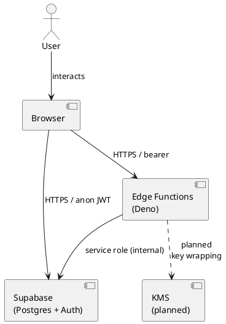

# Architecture Overview

*Scaffold / living document — last updated 2026-04-28. For the full engineering narrative see `docs/technical/architecture-overview.md` and the threat model at `docs/security/threat-model.md`.*

---

## Component diagram (ASCII)

```
┌─────────────────────────────────────────────────────────────────────┐
│                        Browser (React/Vite)                         │
│                                                                     │
│  ┌───────────────┐  ┌─────────────────┐  ┌──────────────────────┐  │
│  │  Auth & ZK    │  │  Session / Squad │  │  Matchmaking / Queue │  │
│  │  (Semaphore)  │  │  (AES-GCM enc)  │  │  (intent tags)       │  │
│  └──────┬────────┘  └────────┬────────┘  └──────────┬───────────┘  │
│         │                   │                        │              │
└─────────┼───────────────────┼────────────────────────┼─────────────┘
          │  HTTPS            │  HTTPS                 │  HTTPS
          ▼                   ▼                        ▼
┌─────────────────────────────────────────────────────────────────────┐
│                     Supabase (hosted Postgres)                      │
│                                                                     │
│  ┌──────────────┐  ┌──────────────┐  ┌────────────────────────┐   │
│  │  Auth        │  │  Postgres    │  │  Edge Functions (Deno) │   │
│  │  (magic link │  │  + RLS       │  │                        │   │
│  │   / OTP)     │  │  + pgcrypto  │  │  verify-zk-proof       │   │
│  └──────────────┘  └──────┬───────┘  │  ingest-message        │   │
│                            │          │  rate-limit (Upstash)  │   │
│  ┌──────────────┐          │          │  crisis-alert          │   │
│  │  Realtime    │◄─────────┘          │  match-notify          │   │
│  │  (WebSocket  │                     └────────────────────────┘   │
│  │   Postgres)  │                                                   │
│  └──────────────┘                                                   │
└─────────────────────────────────────────────────────────────────────┘
          │
          ▼ (optional, future)
┌──────────────────────────────────────┐
│  KMS (AWS / GCP)                     │
│  Wraps squad message encryption keys │
│  — see src/utils/encryption.ts       │
│  scaffold, not yet wired             │
└──────────────────────────────────────┘
```

---

## Data flow: sending a message

```
Browser                     Edge Function              Postgres
  │                         (ingest-message)               │
  │── POST /functions/v1/ingest-message ──────────────────►│
  │   body: { squadId, encryptedPayload (AES-GCM v3) }     │
  │                              │                          │
  │                         Fetch squad key from            │
  │                         squads.message_encryption_key   │
  │                              │◄────────────────────────│
  │                              │                          │
  │                         Decrypt payload                 │
  │                              │                          │
  │                         Run redactOutgoingLiveMessage   │
  │                         (server-side policy redaction)  │
  │                              │                          │
  │                         Re-encrypt with squad key       │
  │                              │                          │
  │                         INSERT via service role ────────►
  │                              │                (ciphertext stored)
  │◄── 200 OK ──────────────────│                          │
```

Key points:
- The browser never sends plaintext to the server (encrypts before POST)
- The Edge Function decrypts server-side, applies policy (moderation redaction), re-encrypts, and stores
- This is **not** E2E against the operator — the server briefly holds plaintext during redaction
- See `docs/security/threat-model.md §5` for the honest characterisation

---

## Data flow: ZK verification

```
Browser                    Edge Function                Postgres
  │                        (verify-zk-proof)                │
  │── Semaphore proof ───────────────────────────────────►  │
  │   (membership proof,                                     │
  │   no raw credential)    │                               │
  │                    Verify proof against                  │
  │                    issuer_groups.current_root            │
  │                         │◄──────────────────────────── │
  │                         │                               │
  │                    If valid: INSERT                      │
  │                    zk_proof_submissions (service role) ─►│
  │                         │                               │
  │◄── 200 OK / 403 ───────│                               │
```

---

## Trust boundaries

| Boundary | What crosses it | Protection |
|---|---|---|
| Browser → Supabase API | Auth tokens, encrypted message payloads | TLS; RLS on API; anon JWT |
| Browser → Edge Functions | Auth bearer token, action params | TLS; server-side user validation |
| Edge Function → Postgres | Service role (trusted) | VPC / Supabase internal network |
| Edge Function → KMS (planned) | Wrapped key fetch/unwrap requests | IAM roles, not yet wired |

---

## Key components in the codebase

| Component | Location | Notes |
|---|---|---|
| Message crypto (browser) | `src/lib/messageCrypto.ts` | AES-256-GCM, Web Crypto API |
| Sentry PII scrubbing | `src/lib/sentry.ts` | beforeSend hook, implemented |
| Request anonymization | `src/middleware/anonymizeRequest.ts` | Header scrub + IP hash, scaffold |
| Rate limiter (Edge) | `supabase/functions/rate-limit/` | Upstash Redis, implemented |
| Rate limiter (server scaffold) | `src/middleware/rateLimiter.ts` | In-memory + Redis pattern, scaffold |
| KMS encryption scaffold | `src/utils/encryption.ts` | AES-GCM + KMS wrapping pattern, scaffold |
| Ingest message (Edge) | `supabase/functions/ingest-message/` | Decrypt, redact, re-encrypt, store |
| Moderation audit RPC | `supabase/migrations/20260428120000_*.sql` | Audited plaintext access |

---

## Limitations (honest)

- **No geographic data residency** today. Supabase is in a single region per project.
- **No true E2E** — squad keys are server-held. See ROADMAP.md for the path forward.
- **No KMS wiring yet** — encryption.ts is a scaffold.
- **No on-device ZK proof storage** — Semaphore identity material is in IndexedDB (session-scoped).

---

## PlantUML stub (for tooling that supports it)


