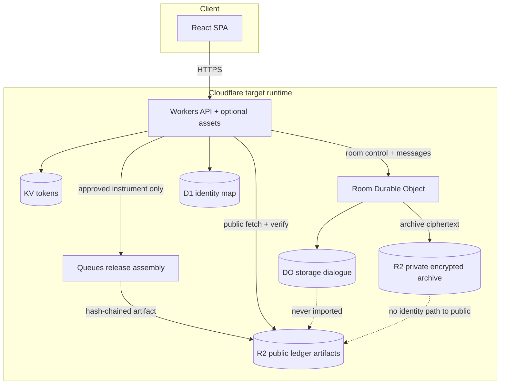

# ADR 006: Cloudflare Workers target runtime for room ≠ record

## Status

**Accepted as target-architecture ADR only.** No production cutover. SquadRidge **today** runs on **Supabase** (Postgres + RLS + Edge Functions + Realtime) and a **Vite** frontend (typically Vercel). Durable Objects, D1, R2, Workers KV, and Queues are **not** the live pilot runtime.

Supersedes nothing. Extends the product spine already described in [`docs/product/platform-description.md`](../product/platform-description.md) and the operator-blind design space in [ADR 005](./005-operator-blind-room-encryption-options.md). Related deferral: [ADR 004](./004-defer-operator-blind-e2e.md).

## Context

Partners and diligence reviewers increasingly describe a clean Cloudflare fullstack for facilitator-led dialogue:

| Concern | Cloudflare primitive |
| ------- | -------------------- |
| Private rooms, facilitator controls, pacing, access | Durable Objects |
| Pseudonymous identities & account mapping | D1 |
| Dialogue (private, never released) | DO storage + R2 encrypted archive |
| Tamper-evident public record | R2 + SHA-256 hash chain, public Worker route |
| Session / access tokens | KV |
| Async record generation | Queues |
| Frontend + API | Workers (assets + script) |

**Key design property:** private dialogue and identities never leave the room Durable Object / private R2; only a facilitator-approved, hash-chained outcome is published as a **new** artifact with **no path back** to dialogue.

That property is already SquadRidge’s north star (**room ≠ record**). This ADR maps the Cloudflare primitives onto what the repo ships today, records an honest migration path, and forbids claiming Cloudflare production until a verified cutover exists.

## Decision

1. **Keep Supabase as the pilot source of truth** (phase 0) until an explicit engineering milestone opens phase 1.
2. **Treat Cloudflare Workers + DO + R2 + D1 + KV + Queues as the target consistency / operator-isolation runtime**, complementary to ADR 005’s crypto options — not as a rebrand of the current stack.
3. **Document the alignment map** below so diligence can see “product property already true; runtime still Supabase-shaped.”
4. **Allow a thin, non-default scaffold** under [`cloudflare/`](../../cloudflare/) for public-ledger hash verification stubs. It must never become the production default without a separate cutover ADR and CI wiring review.
5. **Do not migrate mid-pilot** unless residual-risk criteria in **When NOT to migrate** are cleared.

## Alignment map (Cloudflare → SquadRidge today)

| Cloudflare primitive | Concern | Current SquadRidge equivalent | Honesty note |
| -------------------- | ------- | ----------------------------- | ------------ |
| **Durable Objects** | Room gate, facilitator controls, pacing, floor, phase timer, admission | `sessions` + `session_room_pacing` + floor/timer columns/RPCs (`facilitator_set_floor`, `facilitator_start_phase_timer`, …); Realtime on `session_messages`; RLS + participant token RPCs | Consistency is Postgres + Realtime, not a single-threaded DO. Operator with DB access can still read room ciphertext + keys. |
| **D1** | Pseudonymous identities & account mapping | Supabase Auth (`auth.users`) + `profiles` + `user_roles` + participant rows / contact hashes | Account mapping lives in Postgres; not D1. |
| **DO storage + private R2** | Dialogue never released | `session_messages` (AES-GCM v3 bodies) + `session_room_keys` in Postgres; optional Storage for uploads | Keys are **operator-readable** in Postgres today — **not** DO-private dialogue. See threat model §5 and ADR 005. |
| **R2 + SHA-256 hash chain + public Worker** | Tamper-evident public record | `outcome_records.ledger_sha` via `release_outcome`; public `/ledger` + verify UI; Vite/Vercel host | Integrity of the **released instrument** is LIVE. Cross-record hash **chain** and R2 artifact hosting are **not** the production path yet. |
| **KV** | Session / access tokens | Invite bearer tokens + participant tokens in Postgres; Supabase Auth JWTs; Edge Functions (e.g. `serve-deck` grants) | Token stores are DB/Auth-backed, not Workers KV. |
| **Queues** | Async record generation / release assembly | Synchronous `release_outcome` RPC (+ Edge where used); no Cloudflare Queue consumer | Release is in-process DB work today. |
| **Workers (assets + script)** | Frontend + API | Vite SPA on Vercel + Supabase Edge Functions (Deno) | Edge Functions ≠ Cloudflare Workers production. Optional scaffold: [`cloudflare/`](../../cloudflare/). |

## Target architecture (not production today)

**Invariant preserved across both worlds:** Configure → Verify → Facilitate → Release. Private NGO memo remains the default publish posture; public ledger is opt-in. The released object is always a **new** facilitator-authored instrument bound to approvals and a SHA-256 digest — never a transcript export.

## What already matches (product property)

These hold on the **current Supabase** stack and must remain true under any Cloudflare migration:

1. Room dialogue is not the public record; there is no “publish transcript” path.
2. Participant identities are not attributes of the released ledger card (counts / org labels only).
3. Release is a deliberate facilitator action with hash-bound approvals and authorship attestation (`release_outcome` provenance binding).
4. SHA-256 of approved text is recomputable (`ledger_sha` / verify UX).
5. Spine stages stay Configure → Verify → Facilitate → Release; private memo default for NGO deliberation.

## What is still Supabase-shaped (runtime)

- Room messages, keys, pacing, and audit metadata in **Postgres** with **RLS**.
- Live fan-out via **Supabase Realtime**.
- Privileged paths via **service role** / Edge Functions — honest-but-curious operator can join tables and decrypt room keys (threat model §3 tier 3–5).
- Frontend on **Vercel** (or equivalent static host), not Workers Assets as default.
- No Durable Object single-writer room, no R2 ledger chain, no Queues-based release assembly in production.

**Operator-readable AES-GCM room keys ≠ DO-private dialogue.** ADR 005 remains the crypto design ADR; this ADR is the **runtime consistency / isolation** target that makes “dialogue never leaves the room boundary” an infrastructure property, not only an application convention.

## Migration phases

| Phase | Scope | Exit criteria (summary) |
| ----- | ----- | ----------------------- |
| **0 — Pilot stay** | Keep Supabase + Vite/Vercel. Harden room≠record on current path. | Active pilot stable; no Cloudflare production claim. |
| **1 — Public ledger Worker + R2** | Publish released artifacts to R2; public Worker route serves artifact + verifies SHA-256 (and optional hash-chain head). Supabase remains system of record for drafts/approvals initially. | Dual-read or Worker-primary verify path in staging; threat model updated; no dialogue bytes in public bucket. |
| **2 — Room DO as source of truth** | Durable Object owns gate, pacing, floor, timer, admission, in-room message ordering; DO storage (+ private R2 archive) for dialogue. | Facilitator/participant parity with current control room; failover and break-glass documented; `cloudflare_room_do` may move from PLANNED only after verified deploy. |
| **3 — D1 identity mapping** | Pseudonymous IDs and account/session mapping in D1; minimize PII colocation with room storage. | Mapping schema + retention documented; Auth bridge (Supabase or alternative) specified. |
| **4 — Queues for release assembly** | Async assembly of approved instrument → hash chain append → R2 public put; room DO never enqueues dialogue. | Idempotent consumers; failed-release audit parity with today’s `release_failed` events. |
| **5 — Optional Workers frontend host** | Serve SPA via Workers assets; retire Vercel if desired. | Perf/security review; auth callback URLs updated; CI deploy path documented. |

Phases are **sequential by dependency** (1 before relying on public R2; 2 before claiming DO-private rooms) but phase 5 is optional and may never be required.

## Residual risks / when NOT to migrate

**Do not start phase 1+ mid-pilot when:**

- A live cohort depends on current invite/token RPCs and there is no dual-run or rollback plan.
- Moderator / crisis review and audited decrypt contracts (ADR 004) are unspecified under the new storage boundary.
- Engineering capacity cannot staff DO consistency, key handling, and observeability for at least one full release cycle.
- Diligence or partner contracts still assume Supabase subprocessors and changing vendors would reopen legal review without notice.
- Any temptation exists to **copy dialogue into the public artifact path** “for convenience” — that violates the invariant and is a hard stop.

**Residual risks even after a successful migration:**

- Cloudflare account / Workers TCB and operational access still exist; DO-private ≠ mathematically operator-blind without ADR 005-class key wrapping.
- Hash chain proves integrity of published artifacts, not court-admissible time (RFC 3161 remains separate / scaffolded).
- Misconfigured R2 bucket policies could leak private archives — private vs public buckets must be forcibly separated in IaC and review.

## Implementation status registry

| Claim id | Status | Meaning |
| -------- | ------ | ------- |
| `room_app_layer_encryption` | **LIVE** | Supabase v2 rooms: AES-GCM with operator-readable keys |
| `operator_blind_e2e` | **PLANNED** | Crypto programme (ADR 005) |
| `cloudflare_room_do` | **PLANNED** | Durable Object as room source of truth (this ADR, phase 2) |
| `sha256_anchor` / `approved_outcomes_ledger` | **LIVE** | Release integrity on current stack |

## Consequences

- Diligence docs may describe a **Target runtime (Cloudflare)** without rewriting “what we run today.”
- Marketing and Security UI must not show Durable Objects / R2 / D1 as Live.
- A stub under [`cloudflare/`](../../cloudflare/) is allowed for experimentation; production default remains Vite + Supabase until a cutover ADR.
- Phase 1 is the first engineering milestone that can land value without moving the live room: **public ledger artifact fetch + hash verification on Workers/R2**, fed only by already-approved release payloads.

## References

- [`docs/security/threat-model.md`](../security/threat-model.md) §5
- [`docs/product/platform-description.md`](../product/platform-description.md) — room vs record
- [`docs/technical/diligence-architecture.md`](../technical/diligence-architecture.md)
- [ADR 004](./004-defer-operator-blind-e2e.md) · [ADR 005](./005-operator-blind-room-encryption-options.md)
- [`src/data/implementationStatus.ts`](../../src/data/implementationStatus.ts)
- Scaffold (non-production): [`cloudflare/README.md`](../../cloudflare/README.md)
