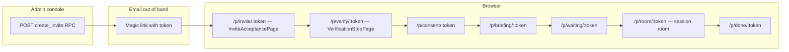
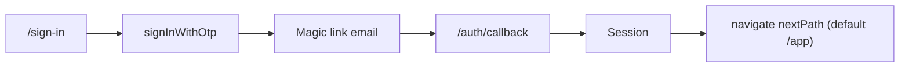

# Audit: invitation, login, and per-role dashboards

**Status:** Living document. First pass on `feat/phase4-role-dashboards-audit` (2026-07-03).
**Companion PRs:** `chore/main-lint-fix`, `feat/phase2-*`, `feat/phase3-*`, `feat/phase4-role-dashboards-audit`.
**Scope:** the seven-role invite-only auth model added in `20260630_001_invite_only_auth.sql`, everything that gates access to authenticated routes, and the per-role landing surface after sign-in.

## 1. Roles, dashboards, and routes (as of audit)

The invite-only migration declares seven roles (`super_admin`, `institution_admin`, `facilitator`, `mediator`, `analyst`, `participant`, `observer`) and a `ROLE_DASHBOARD_MAP` that promises each role has a scoped dashboard URL. Reality:

| Role | `ROLE_DASHBOARD_MAP` (frontend) | `get_default_dashboard_for_user` (RPC) | Route in `App.v2.tsx`? | Result after sign-in |
| ---- | ------------------------------- | -------------------------------------- | ---------------------- | -------------------- |
| `super_admin` | `/app/admin` | `/app/admin` | **No** | **404** (NotFoundPage) |
| `institution_admin` | `/app/institution` | `/app/institution` | **No** | **404** |
| `facilitator` | `/app/facilitator` | `/app/facilitator` | **No** (only `/app` exists) | **404** — unless the redirect happens to be `/app` |
| `mediator` | `/app/mediator` | `/app/mediator` | **No** | **404** |
| `analyst` | `/app/analyst` | `/app/analyst` | **No** | **404** — plus the parent `/app/*` gate excludes them → **/unauthorized** |
| `participant` | `/app/participant` | `/app/participant` | **No** | **404 → /unauthorized** |
| `observer` | `/app/observer` | `/app/observer` | **No** | **404 → /unauthorized** |

The one dashboard that _does_ render — `FacilitatorDashboardPage` at `/app` — isn't reachable by the "canonical" role URL for any role. `SignInPage` happens to default its `nextPath` to `/app`, which is why facilitators sign in fine and everyone else appears to work "sometimes" (via the sign-in redirect) but never via the role-derived redirect.

**This is the single biggest functional gap in the audited surface.**

### 1.1 Guard coverage

`App.v2.tsx` wraps the `/app/*` block in:

```tsx
<RoleProtectedRoute allowed={['super_admin', 'institution_admin', 'facilitator', 'mediator']}>
```

That means `analyst`, `participant`, `observer` are blocked from **every** `/app/*` route today — including any future role-scoped landing page — unless the gate is widened. The narrower `/app/admin/invites` gate (`super_admin`, `institution_admin`) is correct and stays untouched.

### 1.2 Table of routes that _do_ render under the authenticated shell

Everything below is inside the facilitator-styled `AuthenticatedShell`, gated by the above `RoleProtectedRoute`.

| Route | Purpose | Roles that can reach it |
| ----- | ------- | ----------------------- |
| `/app` | FacilitatorDashboardPage (metrics + recent sessions) | super_admin, institution_admin, facilitator, mediator |
| `/app/sessions` | SessionsListPage | same |
| `/app/sessions/new` | SessionSetupPage | same |
| `/app/sessions/:id{/room,/invite,/participants,/control,/outcome,/release}` | Facilitator session sub-pages | same |
| `/app/participants` | ParticipantsIndexPage (facilitator's view of participants — **not** a participant's own dashboard) | same |
| `/app/insights` | InsightsPage | same |
| `/app/outcomes/new` and `/app/outcomes/:id` | OutcomeDraftingPage | same |
| `/app/settings` | Redirect to `/settings` | same |
| `/app/admin/invites` | AdminInvitesPage (invites, access requests, user roles) | super_admin, institution_admin only |

## 2. Invitation flow

Two parallel invitation systems coexist. They serve different personas and neither one is end-to-end wired.

### 2.1 Participant token flow (`/p/*`)

Data flow after `create_invite`:



- `validateInviteToken(token)` is called on the Acceptance page (as of `feat/phase3-invite-acceptance-polish`) and per-reason failure UI is rendered inline. Good.
- `accept_invite(token, userId, displayName)` is **never called** from the client. The RPC exists (`20260630_002_rpc_functions.sql`) and writes into `profiles` + `user_roles` + marks the invite `used_at`, but the participant token flow bypasses it entirely and just clicks through the mocked verification steps.
- Result: **participants who go through `/p/*` never end up with a row in `profiles` or `user_roles`.** They effectively get session access via the token but no persisted account.

### 2.2 Sign-in-based flow (`/sign-in` → magic link)

Data flow:



- Passwordless (no in-app password fields — verified).
- The `nextPath` param supports session deep-links but is not role-aware. If a participant signs in without a `next`, they hit `/app` and get bounced to `/unauthorized`.
- `useDashboardRoute` **exists** as the correct role-aware fallback (returns `profile.last_dashboard` or `resolveLocalDashboard(roles)`) but is **not called anywhere in the auth flow** — only defined. The sign-in and callback both hard-code `nextPath = /app`.

### 2.3 The two flows never meet

- Someone invited as a `facilitator` receives an email with a `/p/invite/:token` URL. That drops them into the **participant** token flow (Acceptance → mock verify → consent → briefing → waiting → room → done). The role from the invite (`facilitator`) is never applied to a `user_roles` row.
- Someone who self-signs-in via `/sign-in` gets a session and no role. If they were pre-invited, that invite's `role_key` never lands on their account.

For the invite-only model to be enforceable, one of these has to happen:
1. The email link points at `/invite/accept?token=…` (a new route) that: signs the user in via `signInWithOtp`, then calls `accept_invite` on callback with the token from `?next`.
2. Or the participant token flow calls `accept_invite` at the end (`/p/done/:token`) with the token.

**This is the second-biggest functional gap.**

## 3. Access protocols by dashboard

Below is what each role _should_ hit and what actually happens today.

### 3.1 Super admin — target `/app/admin`

- **Route:** does not exist.
- **Actual behaviour today:** 404. Since super_admin is in the parent gate, they don't hit /unauthorized; they hit the NotFoundPage inside the shell.
- **Needed:** a landing page with links to the admin console (`/app/admin/invites`), Users, Audit log, System health.

### 3.2 Institution admin — target `/app/institution`

- **Route:** does not exist.
- **Actual behaviour:** 404 inside shell.
- **Needed:** institution overview (member count, workspaces, active facilitators), plus a link to `/app/admin/invites` for scoped grants.

### 3.3 Facilitator — target `/app/facilitator`

- **Route:** does not exist. `/app` renders `FacilitatorDashboardPage`.
- **Actual behaviour:** if `useDashboardRoute` is ever used, they get 404 at `/app/facilitator`. If they get to `/app` (default), it works.
- **Needed:** either the map should point at `/app` (retire `/app/facilitator`), or `/app/facilitator` should be an alias route rendering `FacilitatorDashboardPage`.

### 3.4 Mediator — target `/app/mediator`

- **Route:** does not exist.
- **Actual behaviour:** 404.
- **Needed:** a "sessions I'm mediating today" queue + link to the facilitator-shared session tools. Design decision: does a mediator have its own workspace, or does it share the facilitator shell? The parent gate currently lumps them together — supporting that assumption is fine for v1.

### 3.5 Analyst — target `/app/analyst`

- **Route:** does not exist.
- **Actual behaviour:** **/unauthorized** — analysts aren't in the parent `RoleProtectedRoute` allow-list.
- **Needed:** read-only insights view (published outcomes, aggregate metrics). The parent gate needs to add `analyst`.

### 3.6 Participant — target `/app/participant`

- **Route:** does not exist.
- **Actual behaviour:** /unauthorized — participants aren't in the parent gate.
- **Design tension:** participants normally arrive via `/p/*` token links, not by signing in and navigating to their dashboard. But once a participant _has_ signed in (e.g., because they self-signed to check a past outcome), they need a home. The facilitator shell is inappropriate; a lighter surface listing "upcoming invitations" + "past sessions I attended" is more fitting.
- **Recommended:** either mount at `/participant` outside the facilitator shell, or add a lightweight `/app/participant` inside the shell with a minimal nav. This audit ships the second option because it keeps the fix local.

### 3.7 Observer — target `/app/observer`

- **Route:** does not exist.
- **Actual behaviour:** /unauthorized.
- **Needed:** read-only ledger / published outcomes view. Similar to analyst but with narrower scope.

## 4. Ancillary issues found while auditing

- `AuthCallbackPage` uses a hard-coded `nextPath = safeNextPath(?next)` fallback of `/app`. Same role-blindness as `SignInPage`.
- `useDashboardRoute` returns `/sign-in` when `profile` is null — but a signed-in user with a session but no `profile` row is possible (invite never accepted → no row inserted). That user is stuck in a redirect loop: `/sign-in` → session detected → navigate back to /app → RoleProtectedRoute rejects → /unauthorized. The audit-doc recommends: when session exists but profile is null, route to `/onboarding` (or `/access-pending` if invite is still pending).
- `profile.status = 'pending'` → `useDashboardRoute` returns `/access-pending`. That route is not defined anywhere. Landing there = 404.
- `SignInPage` also renders when session already exists (before the redirect effect fires) — the guard `if (!loading && session) return null;` prevents flicker, but a brief empty screen still shows for one render.

## 5. Design observations

Not blockers, but noted for the "ultra premiumize" ask:

- The three admin panels (`InviteAdminPanel`, `AccessRequestAdminTable`, `UserRolesAdminTable`) each use different design tokens (`text-sq-text`, `text-ink-secondary`, raw hex colours) because they were built at different points in the redesign. They render together on `AdminInvitesPage` and the mismatch is visible. Recommend a shared `<AdminSection>` primitive.
- `FacilitatorDashboardPage` uses semantic tokens (`var(--color-*)`) while the v2 pages under `/pages/v2/*` use a mix of tokens and Tailwind literal colours. Consolidating on `var(--color-*)` (or on the token classes in `tokens.css`) would sharpen consistency and enable dark-mode swaps.
- `SignInPage` and `AuthCallbackPage` use two different shells (`AuthLayout` vs `AccountPageShell`). Different padding, different type ramp, different meta styling. Same for the participant `TokenShell`. Three auth-adjacent shells is one too many.
- Loading states across the app fall into three visual families: skeletons, spinners with `role="status"`, and plain "Loading…" text. `AuthGate` uses the plain-text form; a shared `PageLoader` component would help.

Full "ultra premiumize" is a multi-branch redesign pass — see §7.

## 6. What this branch (`feat/phase4-role-dashboards-audit`) actually ships

Scoped to fix the two functional gaps that block the app from being usable by non-facilitator roles at all:

1. **Six new role dashboard pages** — `SuperAdminDashboardPage`, `InstitutionAdminDashboardPage`, `MediatorDashboardPage`, `AnalystDashboardPage`, `ParticipantDashboardPage`, `ObserverDashboardPage`. Each is intentionally minimal — a header with the role and greeting, 2–4 quick-link cards keyed to the tools that role actually has, and an "About your role" footer. Consistent design language (same tokens, spacing, and card treatment as the facilitator dashboard).
2. **`/app/facilitator` alias route** rendering `FacilitatorDashboardPage` so the map value resolves to a real page.
3. **Widened parent `/app/*` gate** — allows every authenticated role, then each new dashboard has its own narrower `RoleProtectedRoute`. This keeps the shell reachable for analysts/participants/observers when they need a home, without turning any role into an unintended admin.
4. **`useDashboardRoute` wired into `SignInPage` and `AuthCallbackPage`** so post-sign-in redirect respects the user's actual role, not just the hard-coded `/app`.
5. **Sign-in fallback for missing profile** — if session exists but profile is null (invite unaccepted), redirect to `/access-pending` and add a lightweight page for it.
6. **This audit document** — permanent artifact, updated as gaps close.

## 7. Not shipped here (explicit follow-ups)

- **`accept_invite` handshake after sign-in.** The single largest remaining gap. Design decision: a new `/invite/accept?token=…` callback route, or invocation from `/p/done/:token`. Needs product input on which invitations get email-link vs token-link treatment.
- **Consolidation of `AuthLayout` + `AccountPageShell` + `TokenShell`** into a single `AuthShell` variants system.
- **Shared `<AdminSection>` primitive** for the mixed-token admin panels.
- **Full design polish pass** on the six new role dashboards — this branch ships them at a consistent v1 fidelity, not the marketing-page level of the LandingPage. That upgrade is a design-system-first PR.
- **`resolveLocalDashboard` + `ROLE_DASHBOARD_MAP` + `get_default_dashboard_for_user` alignment** — the frontend map and RPC now point at routes that exist (via this branch), but the redirection logic could be simplified by dropping `/app/facilitator` in favor of `/app` alone. That's a small follow-up migration.
