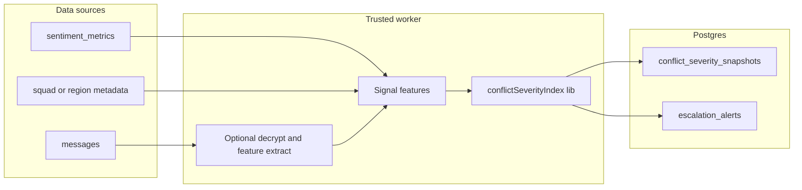

# Conflict Severity Index (CSI) — methodology and data design

**Status:** Design / pilot path — **Postgres + RLS** and the **moderator-only** app route `/admin/csi` are in-repo; a public or partner-facing CSI product surface is not shipped until listed in [`../../CURRENT_STATUS.md`](../../CURRENT_STATUS.md). Aligns with [`csi-spec.md`](csi-spec.md) and [`../security/threat-model.md`](../security/threat-model.md).

## Definition

**CSI** is a composite score on **0–100** intended to rank **escalation pressure** in a **bounded analytics context** (e.g. a pilot program, a region, a time window). It aggregates **multiple normalized signals** derived from dialogue-related inputs **the operator is allowed to process** under that program’s terms.

- CSI is **not** a literal “probability of violence” unless a calibrated model and legal framing say so. Here it is a **relative severity index** for triage and human review.
- **Human in the loop:** elevated CSI triggers **mediator/moderator review** (and optional alerts), not automatic public or kinetic response.

## Composite score

- **Output:** `csi_score` ∈ [0, 100].
- **Bands (operational default):**  
  - **Green:** 0–30 — baseline monitoring  
  - **Yellow:** 31–60 — elevated; increase facilitator attention  
  - **Red:** 61–100 — high; mandatory human review; consider escalation protocols the program has pre-defined  

Weights are **configurable** in application code (see [`../../src/lib/conflictSeverityIndex.ts`](../../src/lib/conflictSeverityIndex.ts)); the default is equal weight across six component dimensions unless a program specifies otherwise.

\[
\text{CSI} = \text{round}\left(\min\left(100, \max\left(0, \sum_i w_i s_i\right)\right)\right)
\]

where each component \(s_i \in [0,100]\) is a **normalized severity** (higher = more concerning) and \( \sum_i w_i = 1\).

`detected_escalation` in storage is `true` when `csi_score` crosses a program-defined threshold (e.g. yellow band entry) *or* when velocity/violence sub-scores exceed local rules—implementation-specific.

## Signals (six components)

### 1. Sentiment trajectory (NLP or surrogate)

- **Idea:** Track affect over time; escalation often tracks rising hostility vs baseline.
- **Inputs:** Per-message (or per-chunk) sentiment labels or scores, ideally from an audited model, or facilitator-entered rubric tags.
- **Primary metric (24h):**  
  - \(p_{\text{neg}} = \) share of messages in a rolling 24h window with **negative** sentiment (or tension above a program threshold).
- **Normalization to 0–100 (example):**  
  - \(s_{\text{sent}} = 100 \cdot \min(1, p_{\text{neg}} / p_{\text{ref}})\) where \(p_{\text{ref}}\) is a program baseline (e.g. 0.15 = 15% as “high” for that locale/model).
- **Data sources in SquadRidge:**  
  - `sentiment_metrics` (per-squad time series) when populated by the AI pipeline in [`../../src/lib/ai/pipeline.ts`](../../src/lib/ai/pipeline.ts) or a server job.  
  - `messages` only after **decrypt/derive** in a **trusted** worker (ciphertext in DB, not for direct NLP in the client for bulk CSI).

### 2. Grievance clustering (theme / topic repeat rate)

- **Idea:** Similar grievance themes flaring in multiple squads may indicate a widening issue, not a single-room spat.
- **Metrics:**  
  - Theme or topic labels per squad-period (NLP, keyword taxonomy, or **facilitator codes** in early pilots—preferred for governance).  
  - **Grievance index:** For theme \(T\), count sessions mentioning \(T\);  
    \[
    g = \min\left(1, \frac{\text{count}(T)}{\max(1, N_{\text{squads}})} \cdot \frac{1}{k}\right)
    \]
    with \(N_{\text{squads}}\) the relevant cohort in the window and \(k\) a scale constant; map \(g \to s_{\text{griev}} \in [0,100]\).
- **“Top 3 grievances”:** The three themes with highest **frequency normalized by squad count** in the window (stored in `component_scores` JSON in snapshots).
- **Data sources:** Aggregated from tagged analytics tables or a batch process; not raw PII. Prefer **pseudonymous squad IDs** in exports.

### 3. Resource scarcity (keyword / entity detection)

- **Idea:** Contestation over water, land, border crossings, aid, or jobs often precedes violence in some contexts.
- **Metric:** Count of resource-scarcity **hits** per **1000 messages** in the window, using a vetted dictionary per pilot language.
- **Normalization:** \(s_{\text{res}} = 100 \cdot \min(1, \text{rate} / r_{\text{ref}})\) with reference rate \(r_{\text{ref}}\) per program.
- **Data sources:** Feature extraction from **decrypted or plain text in a secure worker**; never log raw text to `conflict_severity_snapshots` without policy.

### 4. In-group / out-group language (rhetorical markers)

- **Idea:** Rising “us vs them” and dehumanization correlates with escalation in many settings (error-prone; keep human review).
- **Metric:** Normalized frequency of terms/phrases in an approved **closed lexicon** + optional classifiers; map to \(s_{\text{io}} \in [0,100]\).
- **Data sources:** Same pipeline as (1) or a dedicated feature store.

### 5. Escalation velocity (rate of change)

- **Idea:** The **speed** of deterioration can matter as much as the level.
- **Metrics:**  
  - **Day-over-day** change in mean sentiment (or % negative) between adjacent windows, or a slope in a 7d regression on daily aggregates.
  - Map magnitude of decline to \(s_{\text{vel}} \in [0,100]\) (e.g. 0 = improving or flat, 100 = max adverse velocity observed in calibration).
- **Data sources:** Daily/hourly rollups from `sentiment_metrics` or message-derived aggregates in `conflict_severity_snapshots` time series.

### 6. Violence normalization (rhetoric of justified harm)

- **Idea:** Language that **normalizes** violence or frames it as necessary can warn before acts occur.
- **Metric:** Count of **violence-justifying** statements per **session** (or per 1000 messages) using a vetted pattern set; map to \(s_{\text{viol}} \in [0,100]\).
- **Data sources:** Same trusted NLP path; high-stakes: prefer **two-stage** (model + human spot-check) for policy.

## Data flow (high level)

- **Ingestion frequency (defaults for design):**  
  - **Per-squad** features: on message send (when pipeline enabled) or on a **5–15 minute** tick for batch pilots.  
  - **Regional rollups** for `conflict_severity_snapshots`: **5–15 minutes** for high-attention programs, **1 hour** for broader monitoring—tunable.  
- **Storage:** `conflict_severity_snapshots` holds rollups; `escalation_alerts` stores squad-level (or program-level) triggers for mediators.

## Regional aggregation

- **`region_key`:** A stable string agreed with partners (e.g. `iso:UA-XX:volunteer:2026-Q2` or a coarse conflict-zone label). **Not** a raw user address.  
- **Rollups:** CSI can be stored **per region and time bucket** (use `period_start` / `period_end` in snapshots). **Country**-level views are **coarse** and need minimum participant thresholds to protect anonymity.  
- **Time period:** Use explicit `[period_start, period_end)` in each snapshot row; never imply finer GPS than the program allows.

## Mediator/moderator access and RLS

- Runtime access for humans uses the existing **`moderators`** roster: see migration `20260427120000_conflict_severity_index.sql`. **Service role** (Edge Functions, cron) writes snapshots/alerts; **mediators** (moderators) **read** via RLS. **No** public or anon access.

## Ingestion and internal console

- **Writers:** Only **service role** (or Supabase SQL as ops)—batch jobs that compute regional rollups from allowed features and insert into `conflict_severity_snapshots` / `escalation_alerts`. Browsers with the anon/publishable key **cannot** insert (no policy for `authenticated` insert).
- **Typical pipeline:** (1) Feature extraction in a **trusted** worker (decrypt or use pre-aggregated `sentiment_metrics` / facilitator tags). (2) Call [`computeConflictSeverityIndex`](../../src/lib/conflictSeverityIndex.ts) with `CsiSignalInputs`. (3) Persist the composite score, per-component columns, and JSON trace in `component_scores`. (4) On threshold crossings, write `escalation_alerts` for moderator triage.
- **Human UI:** Authenticated **moderators** can read the same data via the internal **`/admin/csi`** route in the app (no public CSI map until explicitly productized and reviewed).
- **Local dev sample rows:** `supabase/seed.sql` (runs on `supabase db reset`) inserts illustrative squad, snapshot, and alert rows. For a **remote** project, run the same SQL in the Supabase SQL Editor (postgres role) if you need non-empty tables without Docker. Rows stay invisible in the app until your user is in `public.moderators`.

## Reference implementation

- TypeScript: [`../../src/lib/conflictSeverityIndex.ts`](../../src/lib/conflictSeverityIndex.ts) (pure functions, traceability).  
- SQL: [`../../supabase/migrations/20260427120000_conflict_severity_index.sql`](../../supabase/migrations/20260427120000_conflict_severity_index.sql).  

## Evidence and product claims

Do not use CSI in **external** materials as proven prediction until a published methodology, calibration, and partner sign-off exist. See [`../business/impact-metrics.md`](../business/impact-metrics.md) and [`../business/messaging-framework.md`](../business/messaging-framework.md).
