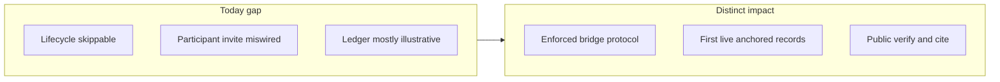
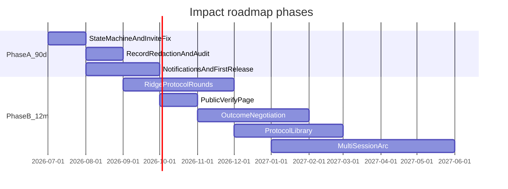

# SquadRidge Impact & Differentiation Roadmap

**Status:** Living strategy doc · **Last updated:** July 2026  
**Related:** [platform-description.md](platform-description.md) · [founding north star](../founding/north-star.md) · [Phase A checklist](../../ROADMAP.md) · [Ridge Protocol spec](ridge-protocol-spec.md)

A phased product strategy to make SquadRidge as distinctive in **effect** as it is in **name**: close credibility gaps in the next 90 days, then build differentiated mediation infrastructure that turns protected dialogue into verifiable, citable outcomes — **without fake pilot claims** or breaking room/record separation.

---

## What “impact like the name” means

**SquadRidge** implies a **narrow, load-bearing path** between two sides — not a chat app, not a call, not a transcript dump. Impact comes when the platform **changes the conditions** of dialogue:

1. **Parties can speak** because the room is structurally protected (not policy-only).
2. **Institutions can cite** because the record is integrity-checked and attribution-free.
3. **Facilitators can run process** because workflow is enforced, not improvised in email.

Distinctiveness = **one clear line between dialogue and record**, made tangible in product behavior — not slogans.

Every feature below is scored against [north-star decision tests](../founding/north-star.md) and [platform-description honest bounds](platform-description.md).

**North-star test for every feature:** Does it make the **bridge** more load-bearing — protected room, structured crossing, verifiable outcome — or does it blur the line?

---

## Phase A — Next 90 days: credibility that enables real impact

These are **prerequisites** for any claim of effect. Without them, the product story outruns reality.

| Priority | Feature / fix | Why it matters | Key files |
| -------- | ------------- | -------------- | --------- |
| **P0** | **Enforced session state machine** — block Facilitate before required verifications; block Release before approvals | Makes Configure → Verify → Facilitate → Release real | DB constraints or RPC guards; `SessionControlPage`, migration |
| **P0** | **Fix participant token invite path** — `/p/invite/:token` must not hit staff `invites` validation | Broken bridge = zero participant impact | `ParticipantInvitePage`, `InviteAcceptancePage`, `participantToken.ts` |
| **P0** | **Architectural record redaction** — outcome editor cannot paste/import raw `session_messages` | Makes “room never becomes record” enforceable | `OutcomeWorkspacePage`; spec `record-redaction-enforcement` |
| **P1** | **Wire workflow notifications** (verify link, room open, approval request, released) | Reduces facilitator overhead | Edge function or Supabase hooks; notification prefs table |
| **P1** | **v2 audit trail** — log verify, room entry, prompt, approval, release (metadata only) | Supports tamper-evidence and pilot diligence | New `session_audit_events` table + RLS |
| **P1** | **First live ledger records** from real pilot sessions | Impact proof without inventing traction | `LedgerIndexPage`, [pilot runbook](../operations/pilot-runbook.md) |
| **P1** | **Unify “New session” entry** — redirect mock wizard to real `/new/setup` | Stops facilitator dead-end demos | `SessionNewPage`, `App.v2.tsx` routing |
| **P2** | **Pre-registered pilot metrics** — verification rate, time-to-release, facilitator rubric, 7-day follow-up | Evidence without “lives saved” overclaim | [evidence-collection.md](../operations/evidence-collection.md), [impact-metrics.md](../business/impact-metrics.md) |

**90-day success signal:** One partner runs a full lifecycle; at least one **live** published record with a verifiable anchor; participant flow works without facilitator workarounds.

**Actionable checklist:** [ROADMAP.md](../../ROADMAP.md) (P0/P1 items with acceptance criteria).

---

## Phase B — 12 months: differentiated features (high impact, feasible)

### B1. The Ridge Protocol — structured written rounds

Mediation-specific **round choreography**, not free chat. Full UX spec: [ridge-protocol-spec.md](ridge-protocol-spec.md).

- **Position round** — each party submits independently (others’ drafts hidden until facilitator opens).
- **Response round** — parties respond to facilitator-synthesized positions, not raw quotes.
- **Cooling interval** — mandatory pause between rounds (configurable per template).
- **Facilitator gate** — advance round only when facilitator releases next prompt.
- **Power of Pause** — port `Slow down` / `Pull back` from legacy session UX into v2 room.

**Constraint:** Facilitator always controls round advancement; no auto-release of positions.

---

### B2. Public anchor verification page (`/ledger/:id/verify`)

Anyone pastes record ID or uploads outcome JSON → recompute SHA-256 → match `ledger_sha`.

**Impact:** Makes “verifiable outcomes” actionable for journalists, funders, and opposing parties.

**Constraint:** Verify **process integrity**, not truth of substance ([terms.md](../legal/terms.md)).

---

### B3. Outcome negotiation workspace (record-only)

Structured **approval with change requests** on outcome text only:

- Side-by-side: draft vs proposed edits.
- Comment threads bound to outcome paragraphs (never linked to room messages).
- Facilitator merges; re-requests approval until consensus or explicit decline.

**Impact:** Solves agreeing what can be said publicly without exposing the room.

---

### B4. Session protocol library (beyond 3 templates)

Expand [`sessionTemplates.ts`](../../src/lib/sessionTemplates.ts):

| Protocol | Use case |
| -------- | -------- |
| Community land-use mediation | Existing template |
| NGO decision memo | Existing template |
| Track II communiqué | Existing template |
| **Ombuds inquiry** | Written submissions + findings summary |
| **Restorative circle (written)** | Impact statements → agreed commitments |
| **Multi-party stakeholder map** | 6+ parties, facilitator-only synthesis round |

Each protocol is a **bounded state machine**, not open DMs.

---

### B5. Facilitator asymmetric briefing (controlled disclosure)

Facilitator posts **side-specific briefings** visible only to one party before joint rounds.

**Security:** Strict RLS on message visibility; threat-model update required.

---

### B6. Multi-session dispute arc

Link sessions under a private **dispute case ID**:

- Session 1 → partial outcome or principles agreed.
- Session 2 → implementation details.
- Public ledger shows **released milestones** only.

---

### B7. Institution release packaging

Released records optionally carry organisation name/logo (with consent), facilitator credential line, optional **witness attestation** (process observed — not content endorsement).

---

### B8. Withdrawal and correction notices on ledger

Formal withdrawal UI: record shows notice + superseding record ID if re-released. Honest governance; avoids “immutable = reckless.”

---

## Phase C — Impact multipliers (12+ months, higher lift)

| Feature | Impact | Feasibility notes |
| ------- | ------ | ----------------- |
| **Room-level E2E encryption** | Strongest privacy for high-risk cohorts | Threat model §13; update all public claims in same release |
| **Offline / low-bandwidth participant path** | Inclusion in degraded connectivity | Async model fits; queue-and-sync for `/p/room` |
| **Citation API / embed** | Ledger embeddable like DOI widgets | External reference without exposing room |
| **Facilitator training mode** | Onboards mediators into Ridge Protocol | Reduces pilot support burden |
| **Program-scoped CSI (internal only)** | Early-warning for partners, not public surveillance | Tables exist; internal until methodology sign-off |

---

## What NOT to build (protects distinctiveness)

| Avoid | Why |
| ----- | --- |
| Video/audio or “use Zoom alongside” | Breaks messaging-only line; exposes identity |
| Public transcript or “AI summary of session” | Collapses room/record |
| Auto-release or auto-drafted public outcomes | Violates `must_not_automate` in platform spec |
| Fake pilot logos, counts, testimonials | Destroys credibility |
| Generic social feed, open matchmaking as v2 headline | Dilutes facilitator-led wedge |
| Population-scale “real-time listening” / global CSI dashboard | Overclaims; conflicts with privacy story |
| “Proven X% conflict reduction” without pre-registered study | Banned per [CURRENT_STATUS.md](../../CURRENT_STATUS.md) |

---

## Recommended implementation order

---

## Related documents

| Document | Purpose |
| -------- | ------- |
| [platform-description.md](platform-description.md) | What SquadRidge is today |
| [ridge-protocol-spec.md](ridge-protocol-spec.md) | B1 round choreography UX spec |
| [ROADMAP.md](../../ROADMAP.md) | Phase A actionable checklist |
| [squadridge_platform_spec.json](../../squadridge_platform_spec.json) | Marketing copy + automation architecture |
| [pilot-runbook.md](../operations/pilot-runbook.md) | Running first real pilot |
