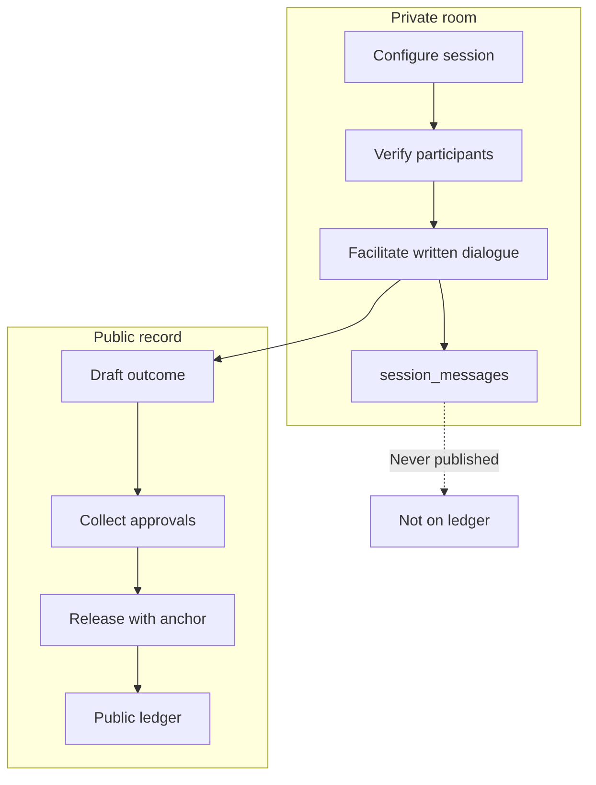
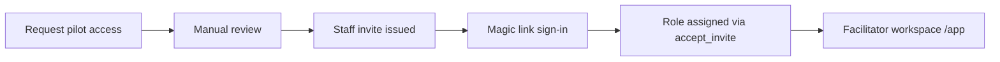

# SquadRidge — Platform Description

**Status:** Private pilot · **Last updated:** July 2026  
**Audience:** Partners, pilot applicants, investors, contributors, and anyone who needs the full, honest picture.  
**Canonical public copy:** [`squadridge_platform_spec.json`](../../squadridge_platform_spec.json) · **Engineering truth:** [`docs/security/threat-model.md`](../security/threat-model.md)

This document is the **single in-depth description** of what SquadRidge is, who it serves, how access works, and what is implemented today versus planned. It deliberately avoids fabricated traction, customer testimonials, or completed-pilot claims. When the public ledger has no live published records, we say so and show **labeled illustrative examples** only.

---

## 1. In one paragraph

SquadRidge is a **structured, text-based, facilitator-led protected dialogue platform** for mediators, peacebuilding organizations, and institutions that run high-stakes conversations where the wrong tool can end the dialogue before it starts. Parties speak in a **private messaging room** under facilitator control; nothing said in the room is published. When dialogue produces something worth standing behind, the facilitator drafts an **outcome**, captures approvals, and **releases** a public record with a **verification anchor** — so anyone can confirm the record has not been altered, without learning who said what. SquadRidge is **not** a video call tool, a general chat app, or a legal instrument. It is infrastructure for one clear line: **protected dialogue, verifiable outcomes.**

---

## 2. Why this exists

### The problem ordinary tools create

Sensitive dialogue fails for predictable reasons:

| Failure mode | What happens |
| ------------ | ------------ |
| **Exposure** | Email threads, shared docs, and open chat leak context, attribution, or drafts before parties are ready. |
| **No credible record** | Video calls leave no integrity-checked public outcome; surveys do not verify who participated; ad-hoc notes are disputable. |
| **Wrong modality** | Real-time voice and video expose faces, voices, and surroundings — the opposite of directional anonymity in high-stakes settings. |
| **No structure** | General messaging apps have no Configure → Verify → Facilitate → Release lifecycle built for mediation. |

SquadRidge exists so facilitators can hold **structured written dialogue** in a room designed for privacy, then release **only what everyone approved** — with a tamper-evident anchor, not a transcript.

### Founding intention

The platform holds one architectural line: **the room and the record are separate by design** — not a policy toggle, not a feature flag. That line protects vulnerable participants, gives institutions audit-grade outcomes, and keeps marketing honest.

Contributors use decision tests in [`docs/founding/north-star.md`](../founding/north-star.md). Public copy uses belief-framed founder statements — **never fabricated customer quotes.**

---

## 3. What SquadRidge is — and is not

### SquadRidge **is**

- A **facilitator-led messaging room** for high-stakes mediated dialogue — structured written rounds under facilitator control.
- A **session lifecycle platform:** Configure → Verify → Facilitate → Release.
- **Invite-only** for staff and facilitators; **token-gated** for session participants who may not need full accounts.
- **Directionally anonymous:** participants are **verified privately** by the facilitator; identities are **confirmed but never disclosed** on the public record.
- A **public ledger of released outcomes** — approved text and limited metadata (organisation, date, participant **count**), each with a verification anchor.
- **Data-minimising by design:** room content stays in the room; only facilitator-approved outcome text may become public.

### SquadRidge **is not**

- **Not a video or audio call platform** — no calls, no call integrations, no “use Zoom alongside.” All structured dialogue on SquadRidge is **written**.
- **Not a general-purpose messenger** — no open DMs, no social feed, no parallel chat surfaces.
- **Not a recording or transcript platform** — session dialogue is not published as a transcript.
- **Not operator-proof end-to-end encryption today** — content is protected in transit (TLS) and access-controlled; see [Security boundaries](#10-security-and-privacy-honest-boundaries).
- **Not anonymous in the “no one knows who you are” sense** — the facilitator verifies eligibility; the platform binds accounts and audit events server-side.
- **Not a legal instrument** — SquadRidge is a process platform; it does not verify the **substance** of outcomes, only that the release process was followed.

---

## 4. Target audiences

SquadRidge speaks first to people who **run** sensitive dialogue, not casual users browsing a social product.

### Primary — Professional mediators and facilitators

**Who:** Certified mediators, community facilitators, ombuds-adjacent practitioners, institutional dispute-resolution leads.

**Job to be done:** Run contentious sessions where parties must speak freely, knowing nothing said in the room will be published — then release a single citable joint statement with the line between conversation and record under facilitator control.

**Why SquadRidge:** Purpose-built lifecycle, verification workflow, protected room, controlled release, verifiable public record.

### Secondary — Peacebuilding NGOs and civil society teams

**Who:** Programme directors, field coordinators, internal governance leads at NGOs and peacebuilding networks.

**Job to be done:** Document deliberations without exposing individuals who took part; give funders and partners a verifiable record of what was agreed — evidence of impact **without** a transcript that could be weaponized.

**Why SquadRidge:** Optional non-public outcomes (template-dependent), staff-only verification, outcome memos instead of raw dialogue.

### Tertiary — Government, ombuds, and Track II actors

**Who:** Track II conveners, policy units, inquiry chairs, board secretariats running sensitive written processes.

**Job to be done:** Convene negotiations or deliberations that need an audit-grade record — without leaking who said what inside the room.

**Why SquadRidge:** Cross-line dialogue template, communiqué-style outcomes, facilitator-signed release.

### Who is **not** the beachhead (today)

- Casual citizens seeking open matchmaking into conflict dialogue (legacy squad path exists in code but is **not** the v2 product story).
- Organizations needing real-time voice/video mediation on-platform.
- Users expecting Signal-grade operator-blind encryption without reading the threat model.

---

## 5. The core architecture: room vs record

This is the product’s central design — everything else serves this separation.

| Dimension | **Room (private)** | **Record (public after release)** |
| --------- | ------------------ | --------------------------------- |
| **Content** | Facilitator prompts + participant written responses | Approved summary, agreed terms, pending items only |
| **Visibility** | Verified participants + facilitator | Anyone with the ledger URL |
| **Identity** | Verified privately; visible to facilitator | **Never** names or attributions |
| **Persistence** | Access-controlled; archived when session closes | Permanent; withdrawal shows notice at record ID |
| **Search** | Not publicly searchable | Ledger search on released metadata + outcome text |

**Unbreakable promises** (architectural, not marketing):

1. No public transcript of session dialogue.
2. Participant identities never appear on the released record.
3. Only the facilitator can release; release is a deliberate human action — not timed or condition-triggered.
4. Tamper-evident verification anchor on every published record.

---

## 6. Session lifecycle

Every v2 mediation session follows four stages. The facilitator owns judgment; the platform automates workflow mechanics where safe.

### Stage 1 — Configure

The facilitator defines the session before anyone enters the room:

- Title, conflict type, language, participant cap.
- **Session template** (community mediation, NGO deliberation, or Track II dialogue) — preloads ground rules, suggested outcome structure, and approval rules.
- Eligibility and verification requirements.
- Whether the outcome will be public on the ledger (template-default; facilitator may adjust within policy).

**Implementation:** Real session creation via `/app/sessions/new/setup` persists to Supabase (`sessions.template_id`, `sessions.setup_config`). A separate setup wizard UI exists but does not persist — facilitators should use the setup path that creates a real session row.

### Stage 2 — Verify

Before the room opens, each required participant is verified **privately**:

- Facilitator invites via secure link (participant token).
- Participant completes verification steps (identity confirmation per facilitator policy).
- Facilitator reviews status on a dashboard: pending / verified / declined.
- The room should not open until required participants are verified.

**Implementation:** Participant rows and facilitator review are backed by the database. Some participant-facing verification UI (e.g. email OTP) is still **simulated in the client** — the facilitator’s manual review on `ParticipantsReviewPage` is the authoritative path for pilot operations.

### Stage 3 — Facilitate

The room opens as a **structured, text-based dialogue environment**:

- Facilitator posts prompts or opens rounds; parties respond **in writing**.
- Dialogue is organized in protected threads — not an open chat free-for-all.
- **No video, no audio, no recording** on SquadRidge.
- Real-time messaging uses Supabase Realtime on `session_messages` (facilitator control room + participant token RPCs).

**Implementation:** `SessionControlPage` (facilitator) and `ParticipantRoomPage` (token path) use live message storage. An alternate mock room UI exists at `/app/sessions/:id/room` for design walkthrough — the operational path is `/control`.

### Stage 4 — Release

When dialogue is ready to become a public (or institution-only) record:

1. Facilitator **drafts the outcome** — human-authored, not auto-generated from chat.
2. System tracks approval requests per participant (`outcome_approvals`).
3. Participants approve, request changes, or decline.
4. When approvals are satisfied, facilitator clicks **Release**.
5. `release_outcome` RPC computes a **SHA-256 verification anchor**, publishes to `outcome_records`, and marks the session released.

**Implementation:** Outcome drafting, approval rows, and release RPC are implemented. Public ledger UI queries published records; when none exist, the ledger shows **illustrative examples** with explicit labeling.

---

## 7. Facilitator-led messaging room model

SquadRidge is intentionally **not** peer-to-peer chat. The facilitator is the process authority:

| Facilitator controls | Platform automates |
| -------------------- | ------------------ |
| Who may enter (after verification) | Invite link generation, status tracking |
| Prompts, rounds, pace, ground rules | Realtime message delivery |
| Whether and when to draft an outcome | Approval request rows |
| **Release decision** (what becomes public) | Anchor computation, ledger publish, session archival flags |

**Written dialogue only:** Parties submit positions in structured rounds. The facilitator organizes flow, de-escalates through process (not surveillance), and ensures the public record contains **outcome text** — not a blow-by-blow of the room.

**Why no video:** Calls expose identity (face, voice, environment), introduce recording risk, and blur the room/record line. The entire protected dialogue happens **inside SquadRidge as text** — never “use video elsewhere and paste notes here.”

---

## 8. Access, sign-in, and invitation model

SquadRidge is **closed during private pilot**. There is no open self-serve signup for facilitators.

### How someone gets access

1. **Request access** — `RequestAccessPage` submits to `access_requests` (work email, role, use case, frequency). Data is used **only for pilot review**, not marketing lists.
2. **Manual review** — SquadRidge team assesses fit. **We do not claim a large existing pilot cohort or named partners unless they are real and approved for public mention.**
3. **Staff invite** — Admin creates invite with role (`facilitator`, `mediator`, `institution_admin`, etc.). Token validated via `validate_invite_token` RPC.
4. **Sign-in** — Passwordless magic link / OTP only (`signInWithOtp`). No password fields.
5. **Invite completion** — After auth, `accept_invite` RPC assigns profile + `user_roles`.
6. **Routing** — `resolvePostAuthPath` sends users to role dashboard, `/access-pending` (no roles yet), or `/unauthorized` (suspended).

### Session participants (no full account required)

Participants in a **specific session** use a **token-gated path** (`/p/*`):

`/p/invite/:token` → verify → consent → briefing → waiting → `/p/room/:token` → done

They interact via participant token RPCs (`participant_send_message`, `participant_list_messages`, consent/verification RPCs) without needing a facilitator-grade account.

**Known gap (pilot):** Session participant invite links and staff invite validation paths must stay aligned — contributors should use the token flow end-to-end, not the staff `/invite/accept` path, for session participants.

### Platform roles

| Role | Purpose | Dashboard |
| ---- | ------- | --------- |
| `super_admin` | Platform administration | `/app/admin` |
| `institution_admin` | Organisation-level admin | `/app/institution` |
| `facilitator` | Runs v2 sessions (primary operator) | `/app/facilitator` |
| `mediator` | Mediation practitioner (alias dashboard) | `/app/mediator` |
| `analyst` | Read-oriented / analytics (shell today) | `/app/analyst` |
| `participant` | Authenticated participant hub | `/app/participant` |
| `observer` | Read-only observer (shell today) | `/app/observer` |

Per-role dashboards are **navigation shells** with quick links — deep role-specific analytics products are not yet shipped.

---

## 9. Session templates

Three templates ship in [`src/lib/sessionTemplates.ts`](../../src/lib/sessionTemplates.ts), selected at session creation:

| Template | Audience | Max participants | Outcome public? | Approval rule |
| -------- | -------- | ---------------- | --------------- | ------------- |
| **Community mediation** | Civil mediators, land/community disputes | 4 | Yes | All verified participants |
| **NGO internal deliberation** | Staff deliberation, funder-safe record | 6 | No (by default) | Facilitator + parties |
| **Track II / cross-line** | Cross-border civil-society dialogue | 4 | Yes | All verified participants |

Each template includes ground rules (written-only, no attribution on public record, facilitator-led rounds), suggested outcome structure, and persisted `setup_config` JSON on the session row.

---

## 10. Public ledger and verification anchors

### What the ledger shows

- Approved **outcome text** (summary, agreed terms, pending items as drafted).
- Limited **metadata:** organisation label, date, participant **count** — never names.
- **Verification anchor** (short display label derived from `ledger_sha`).

### What the anchor proves

- The released record **has not been altered** since release (recompute hash and compare).
- The record was **issued through SquadRidge’s release process** — not pasted from an external doc without audit trail.
- Organisation, date, and included metadata are **as on file** at release time.

### What the anchor does **not** prove

- What was said in the room (private dialogue is not encoded in the anchor).
- Who each participant was.
- That any external party **endorses** the substance.
- That the outcome is **legally binding** or factually true — only that the release process was followed.

### Pilot honesty on ledger content

Until real sessions are released to production:

- The ledger may show **illustrative examples** (`src/data/sampleRecords.ts`) with **“Illustrative example”** badges.
- `LedgerIndexPage` displays a banner when no live published records exist: *“Illustrative examples below. No live published records yet.”*
- **Do not** describe sample records as completed pilots, client outcomes, or traction metrics.

---

## 11. Feature inventory (honest status)

### v2 facilitator platform — primary product story

| Feature | Status |
| ------- | ------ |
| Public marketing site (landing, how-it-works, use cases, security, FAQ, about, contact, legal) | **Shipped** |
| Pilot access request form → `access_requests` | **Shipped** |
| Invite-only auth (magic link, profiles, 7 roles, RLS) | **Shipped** |
| Staff invite create / validate / accept / revoke | **Shipped** |
| Session create with templates | **Shipped** |
| Participant invite tokens + facilitator verification review | **Shipped** (participant UI partially simulated) |
| Live `session_messages` (facilitator + participant paths) | **Shipped** |
| Outcome draft, approvals, `release_outcome` → ledger query | **Shipped** |
| Public ledger UI with sample-data labeling | **Shipped** |
| Facilitator walkthrough (in-app) | **Shipped** |
| Workflow notifications (email at verify/approve/release) | **Planned** — prefs table exists; not fully wired |
| Participant self-serve verification (OTP, document upload) | **Partial** — facilitator review is authoritative |
| Enforced session state machine (block skip steps) | **Partial** — manual status updates |
| Room-level E2E encryption | **Roadmap** — not operator-blind today |

### Legacy product lines (still in codebase — separate stories)

| Feature | Status | Notes |
| ------- | ------ | ----- |
| **Squad matchmaking** (`/match`, `/session/:squadId`) | Legacy, mounted in v2 router | Intent-pool matching, application-layer encrypted squad chat, Semaphore ZK verification path |
| **Incident dialogue rooms** (`/incident`) | Implemented, **not** in v2 router | Structured incident response surface — distinct from mediation sessions |
| **Legacy proposal ledger** (`/ledger-legacy`) | Legacy | Pre-v2 ledger model |
| **Demo squad session** | Dev/staging only | Gated by `VITE_ENABLE_DEMO_SQUAD` |

When describing SquadRidge externally, lead with **v2 facilitator-led mediation**. Mention legacy paths only when speaking to engineers or migration context.

---

## 12. Security and privacy (honest boundaries)

**Source of truth:** [`docs/security/threat-model.md`](../security/threat-model.md) §5.

### Safe to say today

- Session room content is **private and access-controlled**; it is **never published** as a transcript.
- Released records carry a **SHA-256 verification anchor** computed at release.
- Participants are **verified privately**; the public record uses **counts**, not names.
- Transport is **TLS**; data at rest uses platform encryption — but **operators with database access can read v2 room content** (not Signal-style E2E).
- Semaphore ZK proofs are **verified server-side** on the legacy citizen path; submissions bind to `user_id`.

### Do not say (without engineering review)

- “End-to-end encrypted” for session content (unqualified).
- “Full anonymity” or “nobody knows who you are.”
- “Signal-grade” or “operator-blind” encryption.
- “Full platform zero-knowledge.”
- Video/audio capture or integration.
- Quantitative impact claims (% conflict prevented, lives saved) **without methodology and real pilot data**.

Public copy is gated by `npm run check:banned-copy` and mapped in [`docs/security/public-claims-audit.md`](../security/public-claims-audit.md).

---

## 13. Comparison to ordinary tools

| Dimension | SquadRidge | Video call | Shared doc / email | Survey |
| --------- | ---------- | ---------- | ------------------ | ------ |
| Session content | Protected; never published | No integrity-checked record | Exposed by default | No dialogue |
| Participant identity | Verified privately; not on public record | Faces/voices exposed | Often visible | Weak verification |
| Public surface | Approved outcome + anchor only | None | Full thread leak risk | Aggregates only |
| Release control | Facilitator deliberate release | N/A | Informal | N/A |
| Modality | Facilitator-led **written** room | Real-time A/V | Async text | One-shot input |

SquadRidge is **not** “a Zoom alternative.” It is the **protected messaging room and verifiable record** for when Zoom would be the wrong tool.

---

## 14. Private pilot — what we say and do not say

### Accurate pilot framing

- **“Private pilot — now inviting mediators and peacebuilding teams.”**
- **“Request pilot access”** — manual review, 5–7 business day response target on the form.
- **“We work closely with pilot partners”** — present tense invitation to collaborate, **not** a claim that dozens of partners are already live unless true.
- Founder/team **belief statements** on About — not customer testimonials.

### Do not claim (until true and approved)

- Number of completed pilot sessions, partner logos, or advisor names **unless verified for public use**.
- Named organisations as users without their consent.
- Customer quotes or “case studies” from fictional disputes.
- Live ledger records when only samples exist — always label illustrations.
- “Thousands of users,” “proven at scale,” or similar traction language.
- Automated verification or notification flows as fully shipped when UI is still simulated.

Trust bar placeholders in the platform spec (advisor names, pilot count) exist **empty on purpose** — fill only with real data.

---

## 15. Technology stack (summary)

| Layer | Choice |
| ----- | ------ |
| Frontend | React 19, TypeScript, Vite 6, Tailwind CSS, design tokens (`src/styles/tokens.css`) |
| Backend | Supabase (PostgreSQL + RLS + Edge Functions + Realtime) |
| Auth | Supabase Auth — magic link / OTP, invite-only |
| ZK (legacy path) | Semaphore v4 — server-verified proofs |
| Deployment | Vercel (frontend) + Supabase Cloud |

---

## 16. Roadmap and explicit non-goals

**Full strategy:** [impact-roadmap.md](impact-roadmap.md) · **Phase A checklist:** [ROADMAP.md](../../ROADMAP.md) · **Ridge Protocol (B1):** [ridge-protocol-spec.md](ridge-protocol-spec.md)

### Near-term direction (Phase A — next 90 days)

- Enforced session state machine (no skip Verify → Facilitate → Release).
- Fix participant token invite path end-to-end.
- Architectural record redaction in outcome editor.
- Wire workflow notifications at verify / approve / release.
- v2 audit trail (metadata only).
- First **real** published ledger records from pilot sessions (replacing samples).
- Unify “New session” entry to real create path.

### Medium-term differentiation (Phase B — 12 months)

- Ridge Protocol structured written rounds.
- Public anchor verification page (`/ledger/:id/verify`).
- Outcome negotiation workspace (record-only).
- Session protocol library expansion.
- Multi-session dispute arc, institution release packaging, ledger withdrawal UI.

### Long-term multipliers (Phase C)

- Room-level E2E encryption — research/roadmap; see threat model §13.
- Offline/low-bandwidth participant path, citation API, facilitator training mode.

### Explicit non-goals (current product vision)

- Video calls, audio calls, or call integrations.
- Public transcripts of session dialogue.
- Automated release (facilitator must always click Release).
- Legal arbitration or binding adjudication features.
- Fabricated social proof for fundraising or marketing.

---

## 17. Related documents

| Document | Use when |
| -------- | -------- |
| [`squadridge_platform_spec.json`](../../squadridge_platform_spec.json) | Canonical marketing copy and page content |
| [`docs/product/impact-roadmap.md`](impact-roadmap.md) | Impact and differentiation strategy (90-day + 12-month) |
| [`ROADMAP.md`](../../ROADMAP.md) | Phase A actionable checklist |
| [`docs/product/ridge-protocol-spec.md`](ridge-protocol-spec.md) | Ridge Protocol round choreography (B1) |
| [`docs/product-one-pager.md`](../product-one-pager.md) | Short spoken pitch (30s / 2min) |
| [`docs/security/threat-model.md`](../security/threat-model.md) | Engineering and security review |
| [`docs/legal/privacy.md`](../legal/privacy.md) · [`docs/legal/terms.md`](../legal/terms.md) | User-facing legal |
| [`docs/founding/north-star.md`](../founding/north-star.md) | Contributor decision tests |
| [`docs/operations/pilot-runbook.md`](../operations/pilot-runbook.md) | Running a real pilot session |
| [`AGENTS.md`](../../AGENTS.md) | Developer orientation |

---

## 18. Elevator pitches (honest)

**One sentence:**  
SquadRidge lets facilitators run high-stakes dialogue in a protected written room, then release a public outcome anyone can verify — without exposing who said what.

**Thirty seconds:**  
When the conversation is sensitive, ordinary tools fail: calls leave no credible record, docs leak everything, surveys do not verify who spoke. SquadRidge is a facilitator-led messaging room for structured written dialogue, with private verification and a deliberate release step. Only the approved outcome goes public, with a tamper-evident anchor — not a transcript. We are in private pilot, inviting mediators and peacebuilding teams.

**Differentiator in one breath:**  
**Protected room, verifiable record — one clear line between them.**
