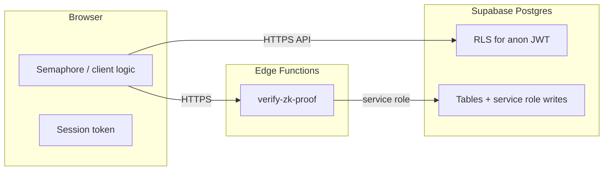

# Operational threat model (engineering)

This document is the **engineering source of truth** for high-stakes deployment decisions. It describes trust boundaries, realistic adversaries, and **what the codebase actually does today** versus **target architecture**. Product copy and investor-facing docs must not claim stronger properties than are listed here without an explicit engineering review.

**Related:** [Data retention (ZK)](../technical/data-retention-zk.md) · [ZK implementation](../technical/zk-implementation.md) · [Security and privacy (overview)](../technical/security-privacy.md)

---

## 1. Scope and stakes

**Goal:** Reduce risk that users in **authoritarian contexts or active conflict** are **re-identified** (linked to real identity, location, or stable real-world persona) through bugs, misuse, platform access, or metadata.

**In scope:** App behavior, Supabase schema/RLS, Edge Functions, client env flags, and operational practices (logging, exports, dashboard access).

**Out of scope unless explicitly designed in:** Tor-only access, regional hosting strategy, legal response playbooks, on-device forensic resistance.

---

## 2. Assets

| Asset | Location / mechanism | Notes |
| ----- | ---------------------- | ----- |
| Account identity | `auth.users`, `public.users.id` | Root identifier for correlation across tables and vendor logs. |
| Email / phone | Supabase Auth (magic link / OTP) | Strong real-world identifier when used. |
| Profile & routing fields | `public.profiles` | Pseudonymous; **re-identification risk** when combined (callsign uniqueness, `region_hint`, language, tags). |
| Matchmaking metadata | `public.match_queue` | `user_id`, `pool_key` (intent tags), `side`, timestamps; Realtime exposure — see migrations. |
| Social graph | `squad_members`, `squads`, `messages` | Who met whom; message timing and volume. |
| Message content | `messages.encrypted_content` | **Not E2E-encrypted in the cryptographic sense today** — see §5. |
| ZK verification records | `zk_proof_submissions`, `verified_attributes` | Proof commitments and nullifiers **bound to `user_id`** server-side — see §5. |

---

## 3. Adversary tiers

Audits and residual-risk sign-off should state which tiers are assumed.

1. **Other participants** — same squad or queue: content, timing, writing style.
2. **Network observer** — ISP, local network: TLS protects content in transit; metadata (timing, volume, SNI/host) may still leak usage patterns depending on hosting and client behavior.
3. **Honest-but-curious operator** — your team, read-only dashboard, backups: can **join tables** in Postgres; RLS limits **client-to-client** abuse, not **operator** visibility.
4. **Compromised operator / breach / compelled access** — same as (3) but adversarial; includes mis-exports and long-lived backups.
5. **Platform vendor (Supabase) / subprocessors** — contractual and technical logging (e.g. auth events, IP at edge); must be documented for residual risk.

---

## 4. Trust boundaries

- **RLS:** Constrains what **other users** can read/write via the Data API; **does not** make data unreadable to privileged DB/service-role access.
- **Edge `verify-zk-proof`:** Verifies proofs and inserts rows; holds **service role** — treat as part of TCB (trusted computing base).

---

## 5. Claims that hold today (verified against code)

These are **safe to treat as engineering facts** until code changes:

- **Semaphore proofs are verified server-side** for non-stub builds: shared handler in `supabase/functions/_shared/handleZkProofVerification.ts` calls `verifyProof` and binds `attribute_scope` / `credential_type` to proof fields before persistence.
- **ZK submissions are tied to the logged-in user:** `zk_proof_submissions` inserts include `user_id`. The platform **learns** “this account produced this proof / nullifier / scope,” even though raw PII from the proof ceremony is not stored as plaintext ID documents.
- **Stub mode is unsafe for real users:** `VITE_ZK_STUB=true` in `src/lib/zkAdapter.ts` skips real Semaphore and Edge verification. **Production builds refuse this** — see `vite.config.ts`.
- **Messages are MVP structured JSON**, not E2E ciphertext from the server’s perspective: `src/lib/messagePayload.ts` documents this; the database operator can read dialogue content unless/until real E2E is implemented.
- **Anonymous Supabase auth** still yields a **persistent user id** (`src/lib/squad.ts`); it is a friction shortcut, not “no account identity on the server.”
- **Matchmaking `pool_key`** encodes sorted intent tags (truncated), stored next to `user_id` — see `src/lib/matchmakingPoolKey.ts` and `supabase/migrations/*matchmaking_queue.sql`.

---

## 6. Pre-deployment gate (checklist)

Use this as a **release gate** for any build aimed at high-risk users. Track completion in issues or a release ticket.

### Architecture and honesty

- [ ] User-facing and investor-facing materials reviewed against §5; no overstated anonymity claims.
- [ ] “Non-goals” documented (what the product does **not** protect against).

### Cryptography and ZK

- [ ] Production build never ships with `VITE_ZK_STUB=true` (CI + `vite` guard).
- [ ] External or internal security review of Semaphore parameters, group setup (`src/lib/zk/`), and scope/message binding in the Edge handler.

### Data minimization

- [ ] Column-level review of `profiles` and `match_queue` for re-identification; retention and TTL for queue rows after match/cancel.
- [ ] Waitlist / marketing DB exports governed — see `scripts/waitlist-export.sql`; restrict who can run exports.

### Messaging

- [ ] Either **real E2E** shipped and documented, or public positioning states **operator-readable** content until then.

### Supabase and operations

- [ ] RLS policies reviewed on all exposed tables; **views** use `security_invoker` where applicable (Postgres 15+).
- [ ] No authorization decisions based on **user-editable** `user_metadata` in JWT (use `app_metadata` / server-side roles for authz).
- [ ] Service role and dashboard access: MFA, minimal headcount, break-glass procedure.
- [ ] Logging: Edge Functions avoid logging full proof bodies; structured outcome-only logs in production.

### Incident readiness

- [ ] Severity-0 definition for suspected mass correlation or export; runbook includes key rotation and comms.

---

## 7. Revision history

| Date | Change |
| ---- | ------ |
| 2026-04-16 | Initial operational threat model aligned with current repo. |
