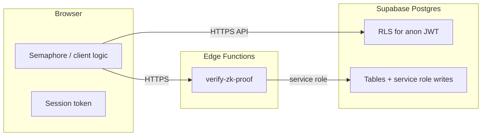

# Operational threat model (engineering)

This document is the **engineering source of truth** for high-stakes deployment decisions. It describes trust boundaries, realistic adversaries, and **what the codebase actually does today** versus **target architecture**. Product copy and investor-facing docs must not claim stronger properties than are listed here without an explicit engineering review.

**Related:** [Data retention (ZK)](../technical/data-retention-zk.md) · [ZK implementation](../technical/zk-implementation.md) · [Security and privacy (overview)](../technical/security-privacy.md) · **§13** (after §7): Semaphore issuer groups, trusted root posture, E2E definition vs MVP

**MVP / marketing:** Public copy, landing pages, and pitch decks must not promise stronger privacy or anonymity than §5 (“Claims that hold today”) and §3 (honest-but-curious operator). If the product roadmap outpaces this document, update the threat model in the same change as the code.

---

## 1. Scope and stakes

**Goal:** Reduce risk that users in **authoritarian contexts or active conflict** are **re-identified** (linked to real identity, location, or stable real-world persona) through bugs, misuse, platform access, or metadata.

**In scope:** App behavior, Supabase schema/RLS, Edge Functions, client env flags, and operational practices (logging, exports, dashboard access).

**Out of scope unless explicitly designed in:** Tor-only access, regional hosting strategy, legal response playbooks, on-device forensic resistance.

---

## 2. Assets

### 2.1 Identity, account, and profile surfaces

| Asset | Location / mechanism | Notes |
| ----- | ---------------------- | ----- |
| Account identity | `auth.users`, `public.users.id` | Root identifier for correlation across tables and vendor logs. |
| Email / phone | Supabase Auth (magic link / OTP) | Strong real-world identifier when used. |
| Profile & routing fields | `public.profiles` | Pseudonymous; **re-identification risk** when combined (callsign uniqueness, `region_hint`, language, tags). **In-squad:** peers see a **limited projection** (callsign, role, coarse tags, region hint) via `get_squad_peer_profiles` — **no global profile directory** or cross-squad search. |

### 2.2 Messaging, matchmaking, ZK, and social graph

| Asset | Location / mechanism | Notes |
| ----- | ---------------------- | ----- |
| Matchmaking metadata | `public.match_queue` | `user_id`, `pool_key` (intent tags ± optional `|zk:` verified scope), `side`, timestamps; Realtime exposure — see migrations. |
| Social graph | `squad_members`, `squads`, `messages` | Who met whom; message timing and volume. Pseudonymous **handles in-room** are visible to squad-mates only (see §2.1). |
| Message content | `messages.payload_ciphertext` | **Not E2E-encrypted in the cryptographic sense today** — see §5. |
| ZK verification records | `zk_proof_submissions`, `verified_attributes` | Proof commitments and nullifiers **bound to `user_id`** server-side — see §5. |

---

## 3. Adversary tiers

Audits and residual-risk sign-off should state which tiers are assumed.

1. **Other participants** — same squad or queue: content, timing, writing style.
2. **Network observer** — ISP, local network: TLS protects content in transit; metadata (timing, volume, SNI/host) may still leak usage patterns depending on hosting and client behavior.
3. **Honest-but-curious operator** — your team, read-only dashboard, backups: can **join tables** in Postgres; RLS limits **client-to-client** abuse, not **operator** visibility.
4. **Compromised operator / breach / compelled access** — same as (3) but adversarial; includes mis-exports and long-lived backups.
5. **Platform vendor (Supabase) / subprocessors** — contractual and technical logging (e.g. auth events, IP at edge); must be documented for residual risk.

---

## 4. Trust boundaries

- **RLS:** Constrains what **other users** can read/write via the Data API; **does not** make data unreadable to privileged DB/service-role access.
- **Edge `verify-zk-proof`:** Verifies proofs and inserts rows; holds **service role** — treat as part of TCB (trusted computing base).

---

## 5. Claims that hold today (verified against code)

These are **safe to treat as engineering facts** until code changes:

- **Semaphore proofs are verified server-side** for non-stub builds: shared handler in `supabase/functions/_shared/handleZkProofVerification.ts` calls `verifyProof` and binds `attribute_scope` / `credential_type` to proof fields before persistence.
- **ZK submissions are tied to the logged-in user:** `zk_proof_submissions` inserts include `user_id`. The platform **learns** “this account produced this proof / nullifier / scope,” even though raw PII from the proof ceremony is not stored as plaintext ID documents.
- **Stub mode is unsafe for real users:** `VITE_ZK_STUB=true` in `src/lib/zkAdapter.ts` skips real Semaphore and Edge verification. **Production builds refuse this** — see `vite.config.ts`.
- **Messages use AES-256-GCM at the application layer (payload v3), not end-to-end encryption against the platform.** `src/lib/messageCrypto.ts` encrypts each message body with a random 12-byte IV; ciphertext lives in `messages.payload_ciphertext` as JSON (`v`, `alg`, `iv`, `ct`). The column name reflects **ciphertext**, not a claim of operator-proof E2E. The **symmetric squad key** is stored in `squads.message_encryption_key` (32 bytes, base64 or base64url). Any member who can `SELECT` the squad row can decrypt all messages for that squad; **moderators** with `Squads_select_moderator` / `Messages_select_moderator` and anyone with **service role** or raw DB access can also read keys and ciphertext. **There is no forward secrecy:** if the squad key is compromised, historical messages decrypt. **There is no key rotation** in the product today. **New squads get a server-generated key** if the client omits it: migration `20260417150000_squads_message_encryption_key_server_default.sql` installs a `BEFORE INSERT` trigger using `pgcrypto` so matchmaking-created squads (and any insert path) are not dependent on “first client message” for key material. `ensureSquadMessageKey` in `src/lib/squadMessageKey.ts` remains a client-side fallback for empty keys. **True E2E** (unreadable by Supabase/operators) would require per-user key distribution (e.g. Signal-style / MLS) and is **not** implemented.
- **Anonymous Supabase auth** still yields a **persistent user id** (`src/lib/squad.ts`); it is a friction shortcut, not “no account identity on the server.”
- **Email sign-in is passwordless (magic link / OTP) only** in the web app (`signInWithOtp` in `AuthContext`). There is no in-app password field; recovery is “request a new link,” not password reset.
- **Matchmaking `pool_key`** encodes sorted intent tags (truncated), stored next to `user_id` — see `src/lib/matchmakingPoolKey.ts` and `supabase/migrations/*matchmaking_queue.sql`.
- **Matchmaking operations:** periodic sweep and queue metrics are documented in [`docs/technical/matchmaking-automation.md`](../technical/matchmaking-automation.md) (cron, `matchmaking_sweep_runs`, service-role-only stats RPC).

---

## 6. Pre-deployment gate (checklist)

Use this as a **release gate** for any build aimed at high-risk users. Track completion in issues or a release ticket.

### Architecture and honesty

- [ ] User-facing and investor-facing materials reviewed against §5; no overstated anonymity claims.
- [ ] “Non-goals” documented (what the product does **not** protect against).

### Cryptography and ZK

- [ ] Production build never ships with `VITE_ZK_STUB=true` (CI + `vite` guard).
- [ ] External or internal security review of Semaphore parameters, group setup (`src/lib/zk/`), and scope/message binding in the Edge handler.

### Data minimization

- [ ] Column-level review of `profiles` and `match_queue` for re-identification; retention and TTL for queue rows after match/cancel.
- [ ] Waitlist / marketing DB exports governed — see `scripts/waitlist-export.sql`; restrict who can run exports.

### Messaging

- [ ] Either **real E2E** shipped and documented, or public positioning states **operator-readable** content until then.

### Supabase and operations

- [ ] RLS policies reviewed on all exposed tables; **views** use `security_invoker` where applicable (Postgres 15+).
- [ ] No authorization decisions based on **user-editable** `user_metadata` in JWT (use `app_metadata` / server-side roles for authz).
- [ ] Service role and dashboard access: MFA, minimal headcount, break-glass procedure.
- [ ] Logging: Edge Functions avoid logging full proof bodies; structured outcome-only logs in production.

### Incident readiness

- [ ] Severity-0 definition for suspected mass correlation or export; runbook includes key rotation and comms.

**Tracking:** File GitHub issues from the templates in [`docs/operations/threat-model-release-checklist-issues.md`](../operations/threat-model-release-checklist-issues.md) instead of checking boxes here without implementation work.

---

## 7. Revision history

| Date | Change |
| ---- | ------ |
| 2026-04-16 | Initial operational threat model aligned with current repo. |
| 2026-04-16 | §5: Documented AES-GCM v3, squad key storage, moderator/service-role access, lack of forward secrecy/E2E, and server default key trigger (`20260417150000_*`). |
| 2026-04-16 | §2: In-squad pseudonymous profile visibility via `get_squad_peer_profiles`; matchmaking `pool_key` may include `|zk:` verified scope. |
| 2026-04-22 | §2 split into §2.1 / §2.2; new §13 (Semaphore issuer groups, trusted root posture, E2E definition vs MVP). |

---

## 13. Semaphore groups, trusted issuance, and end-to-end messaging (roadmap vs today)

*Placed after the revision log so core sections 1–7 stay consecutive for readers; cross-reference in diligence materials may cite “§13” directly.*

This section ties **who can mint Semaphore “membership”** and **messaging key hierarchy** to what partners should assume in **diligence** and **GTM** copy. It is **not** a promise of future ship dates; it is a **trust-root map**.

### 13.1 Issuer groups (Semaphore Merkle set)

- **Current client behavior:** Session proofs are built with a `Group` that includes the user’s **identity commitment** plus a small, **fixed set of in-source decoy commitments** (see `src/lib/zk/buildAnonymityGroup.ts`). That is sufficient for **valid Semaphore proofs** in development, but it is **not** the same as a **large, issuer-maintained anonymity set** operated by a separate credential authority or a public registry of members.
- **Production-strength model (not fully specified in repo):** A realistic deployment uses a **Merkle root / group** updated by a defined **issuer** (or consortium) with clear **eligibility** rules and **revocation** semantics. The Edge verifier’s `verifyProof` checks cryptographic validity against **whatever group parameters** the client and server agree on for that product surface; **misconfiguration** (wrong tree, wrong depth, stale root) is an implementation risk to track in design reviews.
- **Trusted “root” registry:** There is **no** separate, documented **on-chain or org-wide “trusted root registry”** component in the MVP app beyond **Semaphore group parameters and circuit identity** as wired in code. If a partner requires a **named trust anchor** (e.g. a government list root, a humanitarian issuer DID, a smart-contract group factory), that must be **designed, deployed, and named in docs** in the same change as the code path—not implied by “ZK in the product.”

### 13.2 End-to-end messaging (definition used here)

- **E2E (target definition):** Message plaintext is readable only to **end clients** in the session; the **server never holds** material sufficient to bulk-decrypt without **active participation** of clients (e.g. Signal-style or MLS, with a clear story for key distribution and recovery).
- **Not E2E today:** As in §5, **squad symmetric keys in Postgres** mean the operator path can read content; do not describe MVP chat as E2E in **user copy**, **pitch**, or **policy decks** without an engineering review and an updated §5.
- **Roadmap link:** The **pre-deployment gate** in §6 stands: either **ship and document** real E2E, or keep **operator-readable** as the public stance until then.

**Cross-refs:** [ZK implementation](../technical/zk-implementation.md) (Semaphore + Edge) · [Encryption scope](encryption-scope.md) · §5 in this file.
