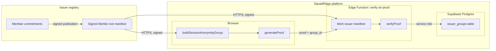

# RFC: Issuer-managed Semaphore anonymity group

**Status:** Implemented v1 (client + Edge wired; manifest refresh cron deferred per §4.3)
**Owners:** ZK / privacy
**Related:** [`docs/security/threat-model.md`](../security/threat-model.md) §13.1 · [`docs/adr/001-use-semaphore-zk.md`](../adr/001-use-semaphore-zk.md) · [`docs/technical/zk-implementation.md`](zk-implementation.md) · [`src/lib/zk/buildAnonymityGroup.ts`](../../src/lib/zk/buildAnonymityGroup.ts) · [`src/lib/zk/issuerManifest.ts`](../../src/lib/zk/issuerManifest.ts) · [`src/lib/zk/issuerRegistry.ts`](../../src/lib/zk/issuerRegistry.ts) · [`supabase/functions/_shared/handleZkProofVerification.ts`](../../supabase/functions/_shared/handleZkProofVerification.ts)

## Revision history

| Date | Change |
| ---- | ------ |
| 2026-04-30 | Status: Draft → Implemented v1. Client proof path now resolves `VITE_ISSUER_GROUP_ID` / `VITE_ISSUER_MANIFEST_URL` / `VITE_ISSUER_SIGNING_KEY_BASE64URL`, builds the group from the issuer's signed manifest via `resolveIssuerRegistry`, and forwards `issuer_group_id` to the Edge verifier so `merkleTreeRoot` is cross-checked against `issuer_groups.current_root`. Decoy / demo path unchanged. |
| 2026-07-17 | §9: Pilot enablement checklist for keeping `VITE_SEMAPHORE_DEMO_GROUP=false` — env, interface sketch, trust model, touchpoints, deferred work. |

## 1. Problem

Today the client builds the Semaphore `Group` for a session proof from:

1. The user's `Identity` (recovered from `semaphoreIdentityStorage`), plus
2. A small set of **bundled-in-source decoys** (`squadridge-decoy-{a,b,c}`) — opt-in via the build-time flag `VITE_SEMAPHORE_DEMO_GROUP=true`.

Bundled decoys are sufficient for a **valid** Semaphore proof but not for a **meaningful** anonymity set. They are public in the source code, fixed across all sessions and tenants, and never updated. As a result:

- A network observer who sees a verifying proof learns "this proof comes from one of `{userIdentity, decoy_a, decoy_b, decoy_c}`" — and three of those four are public, so the set effectively equals one. Anonymity collapses to the user.
- An operator with database access has the same view.
- A compelled-access adversary trivially de-anonymizes the proof to `userIdentity`.

For real pilots the gate in [`buildAnonymityGroup.ts`](../../src/lib/zk/buildAnonymityGroup.ts) (`VITE_SEMAPHORE_DEMO_GROUP=true` required, otherwise throw) prevents shipping bundled decoys silently. But it does **not** ship a real anonymity set; it just refuses to build one.

This RFC sketches the smallest plausible "real" anonymity set: an **issuer-maintained Merkle group** that the client can pull and the Edge verifier can validate against, so `VITE_SEMAPHORE_DEMO_GROUP` can stay `false` in production.

## 2. Goals and non-goals

### Goals

- Allow `VITE_SEMAPHORE_DEMO_GROUP=false` in production while still producing a Semaphore proof whose anonymity set is the issuer's full membership.
- Keep the **Edge verifier** (`supabase/functions/_shared/handleZkProofVerification.ts`) honest: it must verify proofs against a **declared** Merkle root, not whichever group the client happened to send.
- Surface a clean integration interface so multiple issuers (humanitarian org, academic lab, partner registry) can plug in without re-touching `buildSessionAnonymityGroup`.
- Stay incremental — the demo path keeps working unchanged for development and CI.

### Non-goals

- Building a custom credential-issuance ceremony. We assume the issuer already has a way to generate identity commitments for its members (off-platform).
- Solving revocation in this RFC. Revocation is needed eventually, but the first cut can ship with append-only roots and a documented "rotate the whole group" procedure.
- Public on-chain anchoring. Compatible but out of scope; see §7.
- Replacing Semaphore. The change is purely about how `Group` is sourced.

## 3. Non-trivial constraints

- **Edge must enforce the root.** Today the client passes the proof to `verifyProof`; the verifier accepts the Merkle root that the prover used. For a real anonymity set the verifier has to reject any proof whose root is not the **current published root** of an enrolled issuer. Otherwise a malicious client picks its own group of `{user, decoy_*}` and the issuer story is decorative.
- **Group size affects proof time.** Semaphore tree depth dominates `generateProof` time on weak devices; the design must let issuers pick a tree depth without breaking older clients.
- **Identity-commitment privacy.** The list of commitments is public-by-design (it is a Merkle leaf set), but the **mapping** commitment ↔ real identity must stay with the issuer. The platform never holds that map.
- **Root freshness vs. cache.** Clients should be able to use a slightly stale root if the issuer endpoint is unavailable, as long as the verifier still accepts that root. Stale-by-too-many-roots must fail closed.

## 4. Proposed architecture



### 4.1 Issuer manifest

Each issuer publishes a signed manifest at a stable URL (`https://issuer.example/squadridge/manifest.json`) containing:

```json
{
  "group_id": "issuer.example/2026-04-cohort",
  "tree_depth": 20,
  "root": "0xabc…",
  "members_url": "https://issuer.example/squadridge/members.json",
  "issued_at": "2026-04-28T00:00:00Z",
  "expires_at": "2026-05-28T00:00:00Z",
  "signature": "ed25519:…"
}
```

- `members_url` returns the full list of identity commitments (clients fetch only when they need to rebuild a group; issuers may shard or paginate).
- `signature` is over the rest of the manifest fields with the issuer's long-term Ed25519 key. Keys are pinned in `issuer_groups` (see §4.3).
- `expires_at` lets issuers force rotation cadence.

### 4.2 Client flow

`buildSessionAnonymityGroup` gains a new code path keyed on `options.issuerGroupId`:

```ts
buildSessionAnonymityGroup(userIdentity, {
  issuerGroupId: 'issuer.example/2026-04-cohort',
  fetchIssuerManifest, // injectable, defaults to a memoized HTTPS fetch
});
```

1. Resolve the manifest (cache by `group_id`, refresh when `expires_at` is within a configured grace window — see §6.2).
2. Verify the manifest signature against the pinned issuer key.
3. Fetch the member commitments. Build a Semaphore `Group` of declared `tree_depth`, add each commitment, and confirm the resulting root matches `manifest.root`.
4. Return the group. The user's own commitment is **already** in the issuer's set; we do not pad with bundled decoys.

`shouldUseBuiltinSemaphoreDecoys` only allows the demo-decoys branch when `issuerGroupId` is omitted **and** `VITE_SEMAPHORE_DEMO_GROUP=true`. Production calls must always pass an `issuerGroupId`.

### 4.3 Server flow

A new table `issuer_groups` (migration `XXXXXXXXXXXXXX_issuer_groups.sql`) stores enrolled issuers:

```sql
CREATE TABLE public.issuer_groups (
  group_id TEXT PRIMARY KEY,
  manifest_url TEXT NOT NULL,
  signing_key_ed25519 TEXT NOT NULL,
  current_root TEXT NOT NULL,
  current_root_expires_at TIMESTAMPTZ NOT NULL,
  enrolled_at TIMESTAMPTZ NOT NULL DEFAULT now()
);
```

The Edge handler (`handleZkProofVerification.ts`) is extended:

1. Caller passes `{ ..., issuer_group_id }` in the request body.
2. Edge looks up the row, refetches the manifest if `current_root_expires_at` has passed, verifies the signature, updates the cached root.
3. `verifyProof` is called with the Merkle root from the proof object; the handler **rejects** if `proof.merkleTreeRoot !== row.current_root`.
4. Successful verification persists the proof **and** the `issuer_group_id` next to it (a new column on `zk_proof_submissions`).

A scheduled job (existing `pg_cron` infrastructure) refreshes manifests proactively so Edge calls do not block on issuer fetches in the hot path.

### 4.4 Failure modes

| Condition | Behaviour |
| --------- | --------- |
| Issuer endpoint down, cached root still valid | Use cache; succeed. |
| Issuer endpoint down, cached root expired | Edge returns `503` with `errorCode: 'issuer_unavailable'`; client surfaces a banner asking the user to retry later. **Fail closed** rather than accept a stale root. |
| Manifest signature invalid | Edge returns `400` with `errorCode: 'issuer_signature_invalid'`. Operator alert + page (signing key compromise candidate). |
| `issuer_group_id` not enrolled in `issuer_groups` | Edge returns `400` with `errorCode: 'issuer_not_enrolled'`. |
| Client's proof root does not match current published root | Edge returns `400` with `errorCode: 'stale_proof_root'`; client refreshes and re-proves. |

## 5. Touchpoints

Implementation will touch (estimates):

- [`src/lib/zk/buildAnonymityGroup.ts`](../../src/lib/zk/buildAnonymityGroup.ts) — add `issuerGroupId` branch + manifest fetch/verify (~80 LOC + tests).
- New `src/lib/zk/issuerManifest.ts` — manifest fetch, signature verify, cache (~120 LOC + tests).
- [`src/lib/zk/serializeSemaphoreProof.ts`](../../src/lib/zk/serializeSemaphoreProof.ts) — already serializes `merkleTreeRoot`; nothing to change.
- [`supabase/functions/_shared/handleZkProofVerification.ts`](../../supabase/functions/_shared/handleZkProofVerification.ts) — issuer lookup + root cross-check (~60 LOC + tests).
- New migration `supabase/migrations/XXXXXXXXXXXXXX_issuer_groups.sql` — `issuer_groups` table, RLS (service role only), seeded issuer rows per partner.
- [`docs/security/threat-model.md`](../security/threat-model.md) §13.1 — replace "bundled decoys are opt-in" caveat with "issuer-managed groups are mandatory in production; bundled decoys are demo-only."
- `.env.example` — document `VITE_SEMAPHORE_DEMO_GROUP=false` as the default for production deploys.

## 6. Open questions

### 6.1 One issuer per pilot or many?

Cohort partners may want a private group per cohort (so a leaked partner manifest does not deanonymize across cohorts). The design supports many — `group_id` is opaque — but cohort onboarding policy needs to decide whether the platform requires cohort-scoped issuance.

### 6.2 Manifest refresh cadence

`expires_at` is the contract; the open question is the grace window we accept. Initial proposal: refresh when within **15 % of remaining lifetime**, hard fail at `expires_at`. Tunable per `issuer_groups` row if needed.

### 6.3 Member set size and bandwidth

Issuers with very large member sets (10k+) make the `members.json` payload non-trivial. Options: (a) the issuer publishes paginated chunks and the client stitches; (b) the issuer publishes only the Merkle structure and the client never enumerates leaves. (b) is cleaner but requires the client to learn its own leaf path from the issuer; this is doable and is the approach recommended for a future iteration.

### 6.4 Revocation

Out of scope for v1. Documented options for v2:

- **Roll the root** when membership changes (simple, breaks all existing proofs scoped to old root).
- **Add a revocation set** the verifier checks (more complex; more like Semaphore membership-proof + non-revocation).

## 7. Out of scope

- On-chain anchoring of issuer manifests (e.g., publishing `{group_id, root}` to a public chain). Compatible with this RFC and worth doing for issuers who already have an on-chain identity, but does not block v1.
- Decentralized identity (DID)–style binding of issuer keys. Issuer Ed25519 keys are pinned in `issuer_groups` for now; DID resolution can layer on later.
- Migrating existing demo-only data. The demo path stays as-is; production is opt-in by configuring an issuer.

## 8. Acceptance criteria

This RFC is "shipped" when:

1. A non-empty list of `issuer_groups` rows exists in production for at least one cohort.
2. `buildSessionAnonymityGroup` uses the issuer path when called with an `issuerGroupId`, and the bundled-decoy path is reachable only with `VITE_SEMAPHORE_DEMO_GROUP=true`.
3. The Edge verifier rejects proofs whose root does not match `issuer_groups.current_root` (covered by an Edge unit test and an end-to-end test against a synthetic issuer).
4. The threat model § that currently warns about bundled decoys is updated to describe the issuer model and any residual limits.
5. A pilot cohort runs end-to-end with `VITE_SEMAPHORE_DEMO_GROUP=false` for at least one session.

## 9. Pilot enablement — disabling `VITE_SEMAPHORE_DEMO_GROUP`

Real pilots must not rely on bundled decoys. Use this checklist to keep `VITE_SEMAPHORE_DEMO_GROUP=false` (or unset) in production:

### 9.1 Configure issuer env (client)

```bash
# .env / Vercel — production
VITE_SEMAPHORE_DEMO_GROUP=false
# do NOT set VITE_ALLOW_DEMO_DECOYS_IN_PROD
VITE_ISSUER_GROUP_ID=issuer.example/2026-04-cohort
VITE_ISSUER_MANIFEST_URL=https://issuer.example/squadridge/manifest.json
VITE_ISSUER_SIGNING_KEY_BASE64URL=<ed25519-public-key>
```

### 9.2 Interface sketch (`buildAnonymityGroup.ts`)

```ts
// Production path — issuerGroupId required
await buildSessionAnonymityGroup(userIdentity, {
  issuerGroupId: import.meta.env.VITE_ISSUER_GROUP_ID,
});

// Demo path only — gated by shouldUseBuiltinSemaphoreDecoys(env)
await buildSessionAnonymityGroup(userIdentity, {
  // omit issuerGroupId; VITE_SEMAPHORE_DEMO_GROUP must allow decoys
});
```

`shouldUseBuiltinSemaphoreDecoys` returns true only in DEV / test / e2e, or when both demo flags are set in production. Otherwise the issuer path (or an explicit `decoyIdentities` list from a trusted source) is mandatory.

### 9.3 Trust model (operator honesty)

| Party | Sees | Must not hold |
| ----- | ---- | ------------- |
| Issuer | Commitment ↔ real identity map | Platform credentials |
| SquadRidge platform | Commitments + signed Merkle root | Identity map |
| Client prover | Own identity + full leaf set for group build | Issuer signing private key |
| Edge verifier | Proof + `issuer_group_id` + cached root | Identity map |

### 9.4 Integration touchpoints (already landed in v1)

| Touchpoint | Role |
| ---------- | ---- |
| `src/lib/zk/buildAnonymityGroup.ts` | Issuer vs decoy branch |
| `src/lib/zk/issuerManifest.ts` | Fetch + Ed25519 verify + cache |
| `src/lib/zk/issuerRegistry.ts` | Env → group id / URL / key |
| `supabase/functions/_shared/handleZkProofVerification.ts` | Root cross-check vs `issuer_groups` |
| `supabase/migrations/*issuer_groups*` | Enrolled issuers + cached roots |
| `scripts/ensure-no-demo-decoys-prod.mjs` + `vite.config.ts` | CI / build gate |
| Threat model §13.1 | Partner-facing honesty |

### 9.5 Still deferred

- Proactive manifest refresh cron (RFC §4.3) — operators must rotate `issuer_groups` before `current_root_expires_at`.
- Revocation beyond full-group root roll (§6.4).
- Large-member pagination / leaf-path-only client builds (§6.3).
